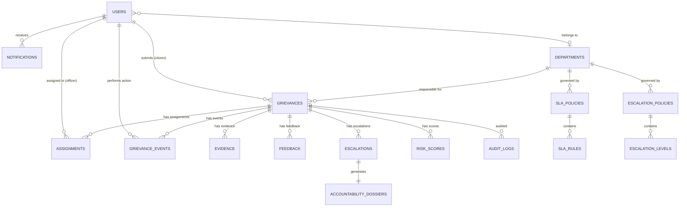

# Data Model

## Design Principles

1. **Referential integrity**: All relationships enforced via foreign keys
2. **Immutable events**: Event and audit tables are append-only
3. **Temporal tracking**: `created_at` and `updated_at` on all mutable entities
4. **Soft deletes**: Use `is_active` flags instead of hard deletes for critical entities
5. **Enumerated states**: Status, priority, role, and category use PostgreSQL enums or lookup tables

## Entity Relationship Diagram



## Core Entity Definitions

### users

| Column | Type | Constraints | Description |
|---|---|---|---|
| `id` | UUID | PK, default gen_random_uuid() | Primary key |
| `email` | VARCHAR(255) | UNIQUE, NOT NULL | Login email |
| `password_hash` | VARCHAR(255) | NOT NULL | bcrypt hash |
| `full_name` | VARCHAR(255) | NOT NULL | Display name |
| `phone` | VARCHAR(20) | NULLABLE | Contact phone |
| `role` | ENUM('CITIZEN','OFFICER','SUPERVISOR','ADMIN') | NOT NULL | User role |
| `department_id` | UUID | FK → departments, NULLABLE | Null for citizens |
| `is_active` | BOOLEAN | DEFAULT true | Soft delete |
| `created_at` | TIMESTAMPTZ | NOT NULL, DEFAULT now() | |
| `updated_at` | TIMESTAMPTZ | NOT NULL, DEFAULT now() | |

### departments

| Column | Type | Constraints | Description |
|---|---|---|---|
| `id` | UUID | PK | |
| `name` | VARCHAR(255) | UNIQUE, NOT NULL | Department name |
| `code` | VARCHAR(50) | UNIQUE, NOT NULL | Short code |
| `description` | TEXT | NULLABLE | |
| `parent_department_id` | UUID | FK → departments, NULLABLE | Hierarchy support |
| `sla_policy_id` | UUID | FK → sla_policies, NULLABLE | Default SLA |
| `escalation_policy_id` | UUID | FK → escalation_policies, NULLABLE | Default escalation |
| `is_active` | BOOLEAN | DEFAULT true | |
| `created_at` | TIMESTAMPTZ | NOT NULL | |
| `updated_at` | TIMESTAMPTZ | NOT NULL | |

### grievances

| Column | Type | Constraints | Description |
|---|---|---|---|
| `id` | UUID | PK | SARA internal ID |
| `reference_number` | VARCHAR(50) | UNIQUE, NOT NULL | Human-readable ID (e.g., GRV-2024-0001) |
| `source_system` | VARCHAR(100) | NOT NULL, DEFAULT 'sara_direct' | Source system identifier |
| `external_id` | VARCHAR(255) | NULLABLE | ID in external system |
| `citizen_id` | UUID | FK → users, NOT NULL | Submitting citizen |
| `description` | TEXT | NOT NULL | Full complaint text |
| `category` | VARCHAR(100) | NULLABLE | AI-classified category |
| `category_confidence` | FLOAT | NULLABLE | Classification confidence |
| `original_category` | VARCHAR(100) | NULLABLE | Category from source (if external) |
| `priority` | ENUM('CRITICAL','HIGH','MEDIUM','LOW') | NULLABLE | AI-assessed priority |
| `priority_score` | INTEGER | NULLABLE | Priority score (0-100) |
| `status` | VARCHAR(50) | NOT NULL, DEFAULT 'SUBMITTED' | Current state machine state |
| `department_id` | UUID | FK → departments, NULLABLE | Assigned department |
| `assigned_officer_id` | UUID | FK → users, NULLABLE | Currently assigned officer |
| `location_text` | TEXT | NULLABLE | Free-text location |
| `latitude` | DECIMAL(10,8) | NULLABLE | GPS latitude |
| `longitude` | DECIMAL(11,8) | NULLABLE | GPS longitude |
| `sla_deadline` | TIMESTAMPTZ | NULLABLE | Computed SLA deadline |
| `risk_score` | INTEGER | NULLABLE, DEFAULT 0 | Current risk score (0-100) |
| `risk_level` | VARCHAR(20) | NULLABLE | LOW/MODERATE/HIGH/VERY_HIGH/CRITICAL |
| `is_escalated` | BOOLEAN | DEFAULT false | Currently escalated |
| `escalation_level` | INTEGER | DEFAULT 0 | Current escalation level |
| `resolution_notes` | TEXT | NULLABLE | Officer's resolution description |
| `ai_summary` | TEXT | NULLABLE | AI-generated summary |
| `embedding` | VECTOR(384) | NULLABLE | Sentence embedding for duplicate detection |
| `created_at` | TIMESTAMPTZ | NOT NULL | |
| `updated_at` | TIMESTAMPTZ | NOT NULL | |
| `acknowledged_at` | TIMESTAMPTZ | NULLABLE | When officer acknowledged |
| `resolved_at` | TIMESTAMPTZ | NULLABLE | When resolution submitted |
| `closed_at` | TIMESTAMPTZ | NULLABLE | When verified and closed |
| `reopened_count` | INTEGER | DEFAULT 0 | Number of times reopened |

### grievance_events

| Column | Type | Constraints | Description |
|---|---|---|---|
| `id` | UUID | PK | |
| `grievance_id` | UUID | FK → grievances, NOT NULL | |
| `event_type` | VARCHAR(50) | NOT NULL | Event type from catalog |
| `from_state` | VARCHAR(50) | NULLABLE | Previous state |
| `to_state` | VARCHAR(50) | NULLABLE | New state |
| `actor_id` | UUID | FK → users, NULLABLE | Who triggered (null for system) |
| `actor_role` | VARCHAR(20) | NULLABLE | Role at time of action |
| `metadata` | JSONB | DEFAULT '{}' | Event-specific data |
| `remarks` | TEXT | NULLABLE | Human-readable notes |
| `created_at` | TIMESTAMPTZ | NOT NULL | Immutable timestamp |

> [!IMPORTANT]
> This table is **append-only**. No UPDATE or DELETE operations permitted from the application layer.

### assignments

| Column | Type | Constraints | Description |
|---|---|---|---|
| `id` | UUID | PK | |
| `grievance_id` | UUID | FK → grievances, NOT NULL | |
| `officer_id` | UUID | FK → users, NOT NULL | Assigned officer |
| `assigned_by` | UUID | FK → users, NULLABLE | Who assigned (null for auto) |
| `assignment_type` | ENUM('AUTO','MANUAL','ESCALATION') | NOT NULL | How assigned |
| `is_active` | BOOLEAN | DEFAULT true | Current assignment |
| `assigned_at` | TIMESTAMPTZ | NOT NULL | |
| `unassigned_at` | TIMESTAMPTZ | NULLABLE | When reassigned |

### evidence

| Column | Type | Constraints | Description |
|---|---|---|---|
| `id` | UUID | PK | |
| `grievance_id` | UUID | FK → grievances, NOT NULL | |
| `uploaded_by` | UUID | FK → users, NOT NULL | |
| `file_name` | VARCHAR(255) | NOT NULL | Original filename |
| `file_path` | VARCHAR(500) | NOT NULL | Storage path |
| `file_type` | VARCHAR(50) | NOT NULL | MIME type |
| `file_size_bytes` | BIGINT | NOT NULL | File size |
| `evidence_type` | ENUM('PHOTO','DOCUMENT','WORK_ORDER','OTHER') | NOT NULL | |
| `description` | TEXT | NULLABLE | Evidence description |
| `metadata` | JSONB | DEFAULT '{}' | Extracted metadata (EXIF, etc.) |
| `created_at` | TIMESTAMPTZ | NOT NULL | |

### feedback

| Column | Type | Constraints | Description |
|---|---|---|---|
| `id` | UUID | PK | |
| `grievance_id` | UUID | FK → grievances, NOT NULL | |
| `citizen_id` | UUID | FK → users, NOT NULL | |
| `feedback_type` | ENUM('VERIFICATION','SATISFACTION','COMMENT') | NOT NULL | |
| `is_satisfied` | BOOLEAN | NULLABLE | For verification: true=confirm, false=reject |
| `rating` | INTEGER | NULLABLE | 1-5 satisfaction rating |
| `comments` | TEXT | NULLABLE | |
| `created_at` | TIMESTAMPTZ | NOT NULL | |

### escalations

| Column | Type | Constraints | Description |
|---|---|---|---|
| `id` | UUID | PK | |
| `grievance_id` | UUID | FK → grievances, NOT NULL | |
| `escalation_level` | INTEGER | NOT NULL | 1, 2, 3... |
| `trigger_reason` | VARCHAR(100) | NOT NULL | SLA_BREACH, CITIZEN_REJECTED, etc. |
| `escalated_to` | UUID | FK → users, NOT NULL | Target authority |
| `escalated_from` | UUID | FK → users, NULLABLE | Previous assignee |
| `risk_score_at_escalation` | INTEGER | NOT NULL | Risk score when escalated |
| `risk_explanation` | JSONB | NOT NULL | Factor breakdown |
| `status` | ENUM('PENDING','REVIEWED','RESOLVED','OVERRIDDEN') | NOT NULL | |
| `reviewed_at` | TIMESTAMPTZ | NULLABLE | |
| `reviewer_notes` | TEXT | NULLABLE | |
| `dossier_id` | UUID | FK → accountability_dossiers, NULLABLE | |
| `created_at` | TIMESTAMPTZ | NOT NULL | |

### accountability_dossiers

| Column | Type | Constraints | Description |
|---|---|---|---|
| `id` | UUID | PK | |
| `grievance_id` | UUID | FK → grievances, NOT NULL | |
| `escalation_id` | UUID | FK → escalations, NULLABLE | |
| `generated_at` | TIMESTAMPTZ | NOT NULL | |
| `content` | JSONB | NOT NULL | Structured dossier data |
| `version` | INTEGER | NOT NULL, DEFAULT 1 | Dossier version (regenerated on updates) |

### risk_scores

| Column | Type | Constraints | Description |
|---|---|---|---|
| `id` | UUID | PK | |
| `grievance_id` | UUID | FK → grievances, NOT NULL | |
| `score` | INTEGER | NOT NULL | 0-100 |
| `level` | VARCHAR(20) | NOT NULL | Risk level label |
| `factors` | JSONB | NOT NULL | Factor-by-factor breakdown |
| `computed_at` | TIMESTAMPTZ | NOT NULL | |

### sla_policies

| Column | Type | Constraints | Description |
|---|---|---|---|
| `id` | UUID | PK | |
| `name` | VARCHAR(255) | NOT NULL | Policy name |
| `description` | TEXT | NULLABLE | |
| `is_default` | BOOLEAN | DEFAULT false | Default policy for unassigned depts |
| `is_active` | BOOLEAN | DEFAULT true | |
| `created_at` | TIMESTAMPTZ | NOT NULL | |
| `updated_at` | TIMESTAMPTZ | NOT NULL | |

### sla_rules

| Column | Type | Constraints | Description |
|---|---|---|---|
| `id` | UUID | PK | |
| `sla_policy_id` | UUID | FK → sla_policies, NOT NULL | |
| `priority` | ENUM('CRITICAL','HIGH','MEDIUM','LOW') | NOT NULL | |
| `resolution_deadline_hours` | INTEGER | NOT NULL | |
| `acknowledgment_deadline_hours` | FLOAT | NOT NULL | |
| `first_update_deadline_hours` | FLOAT | NOT NULL | |
| `warning_threshold_percent` | INTEGER | NOT NULL, DEFAULT 50 | |

### escalation_policies

| Column | Type | Constraints | Description |
|---|---|---|---|
| `id` | UUID | PK | |
| `name` | VARCHAR(255) | NOT NULL | |
| `description` | TEXT | NULLABLE | |
| `is_default` | BOOLEAN | DEFAULT false | |
| `is_active` | BOOLEAN | DEFAULT true | |
| `created_at` | TIMESTAMPTZ | NOT NULL | |
| `updated_at` | TIMESTAMPTZ | NOT NULL | |

### escalation_levels

| Column | Type | Constraints | Description |
|---|---|---|---|
| `id` | UUID | PK | |
| `policy_id` | UUID | FK → escalation_policies, NOT NULL | |
| `level` | INTEGER | NOT NULL | 1, 2, 3... |
| `trigger_event` | VARCHAR(50) | NOT NULL | SLA_WARNING, SLA_BREACH, etc. |
| `action` | ENUM('SEND_REMINDER','ESCALATE') | NOT NULL | |
| `target_role` | VARCHAR(50) | NOT NULL | ASSIGNED_OFFICER, SUPERVISOR, etc. |
| `generate_dossier` | BOOLEAN | DEFAULT false | |
| `cooldown_minutes` | INTEGER | DEFAULT 0 | |
| `condition_expression` | TEXT | NULLABLE | Optional condition (e.g., "breach_count >= 2") |

### notifications

| Column | Type | Constraints | Description |
|---|---|---|---|
| `id` | UUID | PK | |
| `user_id` | UUID | FK → users, NOT NULL | Recipient |
| `grievance_id` | UUID | FK → grievances, NULLABLE | Related grievance |
| `type` | VARCHAR(50) | NOT NULL | REMINDER, SLA_WARNING, ESCALATION, etc. |
| `title` | VARCHAR(255) | NOT NULL | |
| `message` | TEXT | NOT NULL | |
| `is_read` | BOOLEAN | DEFAULT false | |
| `created_at` | TIMESTAMPTZ | NOT NULL | |
| `read_at` | TIMESTAMPTZ | NULLABLE | |

### audit_logs

| Column | Type | Constraints | Description |
|---|---|---|---|
| `id` | UUID | PK | |
| `actor_id` | UUID | FK → users, NULLABLE | |
| `actor_role` | VARCHAR(20) | NULLABLE | |
| `action` | VARCHAR(100) | NOT NULL | Operation performed |
| `resource_type` | VARCHAR(50) | NOT NULL | Table/entity affected |
| `resource_id` | UUID | NULLABLE | Entity ID |
| `previous_state` | JSONB | NULLABLE | State before change |
| `new_state` | JSONB | NULLABLE | State after change |
| `reason` | TEXT | NULLABLE | |
| `ip_address` | INET | NULLABLE | |
| `created_at` | TIMESTAMPTZ | NOT NULL | |

> [!IMPORTANT]
> This table is **append-only**. No UPDATE or DELETE operations permitted.

### integrations

| Column | Type | Constraints | Description |
|---|---|---|---|
| `id` | UUID | PK | |
| `source_system` | VARCHAR(100) | UNIQUE, NOT NULL | |
| `adapter_type` | VARCHAR(100) | NOT NULL | |
| `config` | JSONB | NOT NULL | Encrypted connection config |
| `status_mapping` | JSONB | NOT NULL | External → SARA status mapping |
| `is_active` | BOOLEAN | DEFAULT true | |
| `sync_enabled` | BOOLEAN | DEFAULT false | |
| `sync_interval_minutes` | INTEGER | DEFAULT 60 | |
| `last_sync_at` | TIMESTAMPTZ | NULLABLE | |
| `created_at` | TIMESTAMPTZ | NOT NULL | |
| `updated_at` | TIMESTAMPTZ | NOT NULL | |

## Indexes

### Performance-Critical Indexes

```sql
-- Grievance queries
CREATE INDEX idx_grievances_status ON grievances(status);
CREATE INDEX idx_grievances_department ON grievances(department_id);
CREATE INDEX idx_grievances_officer ON grievances(assigned_officer_id);
CREATE INDEX idx_grievances_citizen ON grievances(citizen_id);
CREATE INDEX idx_grievances_priority ON grievances(priority);
CREATE INDEX idx_grievances_risk ON grievances(risk_score DESC);
CREATE INDEX idx_grievances_sla ON grievances(sla_deadline) WHERE status NOT IN ('CLOSED');
CREATE INDEX idx_grievances_created ON grievances(created_at DESC);

-- Vector similarity search
CREATE INDEX idx_grievances_embedding ON grievances USING hnsw (embedding vector_cosine_ops);

-- Event queries
CREATE INDEX idx_events_grievance ON grievance_events(grievance_id, created_at);
CREATE INDEX idx_events_type ON grievance_events(event_type);

-- Notification queries
CREATE INDEX idx_notifications_user_unread ON notifications(user_id) WHERE is_read = false;

-- Audit log queries
CREATE INDEX idx_audit_resource ON audit_logs(resource_type, resource_id);
CREATE INDEX idx_audit_actor ON audit_logs(actor_id, created_at DESC);
```

## PostgreSQL Extensions Required

```sql
CREATE EXTENSION IF NOT EXISTS "uuid-ossp";    -- UUID generation
CREATE EXTENSION IF NOT EXISTS "pgvector";      -- Vector similarity search
CREATE EXTENSION IF NOT EXISTS "pg_trgm";       -- Trigram text search (optional)
```
