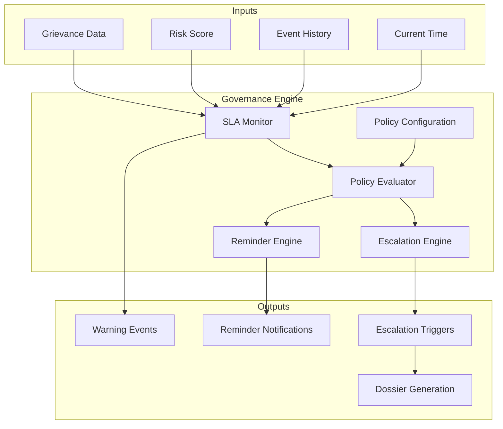
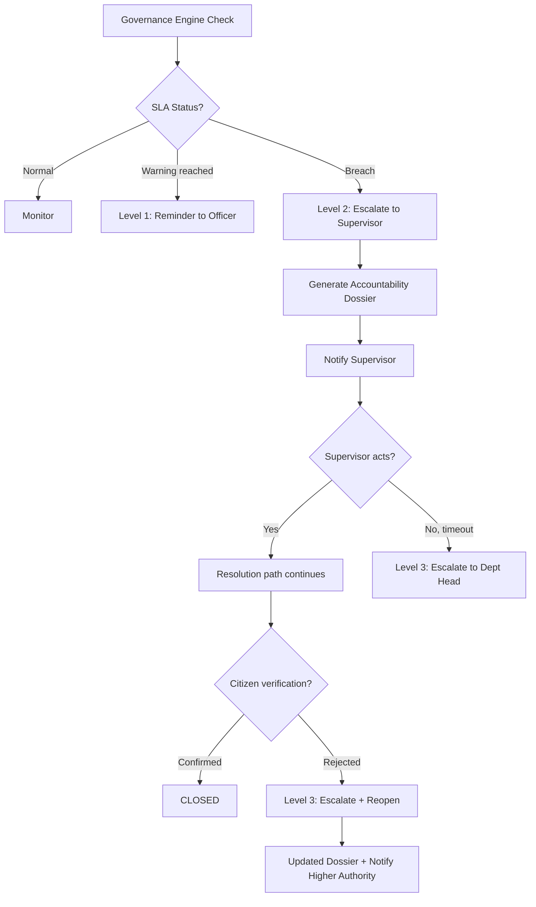
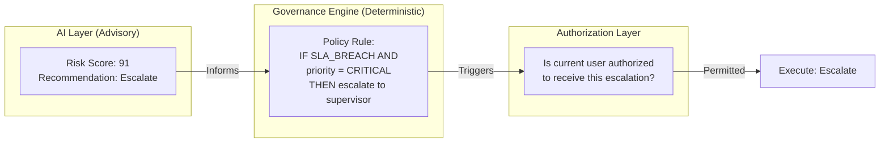

# Governance Engine

## Purpose

The Governance Engine is the deterministic decision-making core of SARA. It enforces SLA policies, escalation rules, and reminder schedules based on configurable policies — **not** AI predictions.

> **Key principle**: AI provides risk signals and recommendations. The Governance Engine makes rule-based decisions. Authorized humans make consequential decisions.

## Architecture



## SLA Policy Engine

### Policy Structure

```json
{
  "policy_id": "uuid",
  "name": "Municipal Services SLA",
  "department_id": "uuid",
  "rules": [
    {
      "priority": "CRITICAL",
      "resolution_deadline_hours": 4,
      "acknowledgment_deadline_hours": 0.5,
      "first_update_deadline_hours": 1,
      "warning_threshold_percent": 50,
      "breach_threshold_percent": 100
    },
    {
      "priority": "HIGH",
      "resolution_deadline_hours": 24,
      "acknowledgment_deadline_hours": 2,
      "first_update_deadline_hours": 4,
      "warning_threshold_percent": 50,
      "breach_threshold_percent": 100
    },
    {
      "priority": "MEDIUM",
      "resolution_deadline_hours": 168,
      "acknowledgment_deadline_hours": 8,
      "first_update_deadline_hours": 24,
      "warning_threshold_percent": 75,
      "breach_threshold_percent": 100
    },
    {
      "priority": "LOW",
      "resolution_deadline_hours": 336,
      "acknowledgment_deadline_hours": 24,
      "first_update_deadline_hours": 48,
      "warning_threshold_percent": 75,
      "breach_threshold_percent": 100
    }
  ]
}
```

### SLA Monitoring Logic

```python
# Conceptual — runs as periodic background task
def check_sla(grievance, policy):
    elapsed = now() - grievance.sla_start_time
    deadline = policy.get_deadline(grievance.priority)
    percent_consumed = (elapsed / deadline) * 100

    if percent_consumed >= policy.breach_threshold:
        emit_event(SLA_BREACH, grievance)
        evaluate_escalation(grievance)
    elif percent_consumed >= policy.warning_threshold:
        emit_event(SLA_WARNING, grievance)
        send_reminder(grievance.assigned_officer)

    # Check sub-milestones
    if not grievance.acknowledged:
        ack_deadline = policy.get_ack_deadline(grievance.priority)
        if elapsed > ack_deadline:
            emit_event(REMINDER_SENT, grievance, type="acknowledgment_overdue")
```

## Escalation Policy Engine

### Policy Structure

```json
{
  "policy_id": "uuid",
  "name": "Standard Escalation Policy",
  "department_id": "uuid",
  "levels": [
    {
      "level": 1,
      "trigger": "SLA_WARNING",
      "action": "SEND_REMINDER",
      "target": "ASSIGNED_OFFICER",
      "cooldown_minutes": 30
    },
    {
      "level": 2,
      "trigger": "SLA_BREACH",
      "action": "ESCALATE",
      "target": "DEPARTMENT_SUPERVISOR",
      "generate_dossier": true,
      "cooldown_minutes": 60
    },
    {
      "level": 3,
      "trigger": "CITIZEN_REJECTED",
      "condition": "evaluate_rejection_risk(grievance)",
      "action": "ESCALATE",
      "target": "DEPARTMENT_HEAD",
      "generate_dossier": true,
      "cooldown_minutes": 0
    },
    {
      "level": 4,
      "trigger": "REPEATED_BREACH",
      "condition": "breach_count >= 2",
      "action": "ESCALATE",
      "target": "ORGANIZATION_HEAD",
      "generate_dossier": true
    }
  ]
}
```

### Dynamic Citizen Rejection Evaluation

Citizen rejection must always reopen the grievance, but escalation is evaluated by the Governance Engine rather than automatically escalating every rejection to the highest level.

The `evaluate_rejection_risk(grievance)` condition considers:
1. **Priority**: Critical/High priority issues escalate faster.
2. **SLA State**: Is the SLA already breached?
3. **Risk Score**: Escalate if the risk score is already high.
4. **Complaint Age**: Older complaints escalate faster.
5. **Evidence Quality**: Were previous resolution attempts lacking evidence?
6. **Previous Rejections**: Repeated rejections trigger immediate escalation.
7. **Previous Escalations**: If already escalated, notify higher authority.

### Escalation Decision Flow



### Escalation Rule Evaluation (Pseudocode)

```python
def evaluate_escalation(grievance, event):
    policy = get_escalation_policy(grievance.department_id)

    for level in policy.levels:
        if level.trigger == event.type:
            if level.condition and not evaluate_condition(level.condition, grievance):
                continue

            if cooldown_active(grievance, level):
                continue

            if level.action == "SEND_REMINDER":
                send_reminder(grievance, level.target)
                emit_event(REMINDER_SENT, grievance)

            elif level.action == "ESCALATE":
                target = resolve_target(level.target, grievance)
                if level.generate_dossier:
                    dossier = generate_dossier(grievance)
                escalate(grievance, target, dossier)
                emit_event(ESCALATION_TRIGGERED, grievance, level=level.level)
            break  # Only trigger first matching level
```

## Reminder Engine

### Reminder Types

| Type | Trigger | Recipient |
|---|---|---|
| Acknowledgment reminder | Officer hasn't acknowledged within deadline | Assigned officer |
| Progress reminder | No update within configured interval | Assigned officer |
| SLA warning | SLA warning threshold reached | Assigned officer + supervisor |
| Verification reminder | Citizen hasn't responded to verification | Citizen |
| Escalation notice | Case has been escalated | Supervisor |

### Reminder Configuration

```json
{
  "reminder_policy": {
    "max_reminders_before_escalation": 3,
    "reminder_interval_minutes": {
      "CRITICAL": 30,
      "HIGH": 120,
      "MEDIUM": 1440,
      "LOW": 2880
    },
    "citizen_verification_reminder_hours": 24
  }
}
```

## Policy Configuration Interface

Administrators can configure:

| Policy Area | Configurable Parameters |
|---|---|
| SLA Policies | Resolution deadline per priority, acknowledgment deadline, warning threshold |
| Escalation Policies | Trigger conditions, target authorities, dossier generation, cooldowns |
| Reminder Policies | Intervals, max count before escalation, message templates |
| Department Configuration | Assigned policies, officer roster, default priority |
| Category Configuration | Default priority baseline, routing rules |

All policy changes are themselves audit-logged.

## Reassignment Rules

| Scenario | Action | Actor |
|---|---|---|
| Citizen rejects resolution | System flags for reassignment; supervisor decides | Supervisor (human) |
| SLA breached with no action | Escalation to supervisor; supervisor may reassign | Supervisor (human) |
| Officer goes inactive (no login for configured period) | Alert supervisor; supervisor reassigns | Supervisor (human) |
| Officer explicitly requests transfer | Supervisor reviews and reassigns | Supervisor (human) |
| Misrouted complaint (wrong department) | Admin re-routes to correct department | Admin (human) |

> [!IMPORTANT]
> SARA **does not auto-reassign officers**. All reassignment is initiated or approved by a human supervisor/admin. The system can only recommend reassignment via risk alerts and escalation dossiers.

## Human Approval Requirements

SARA enforces human-in-the-loop for all consequential decisions:

| Action | Automated? | Human Required? |
|---|---|---|
| SLA warning notification | ✅ Automated | ❌ No |
| Reminder to officer | ✅ Automated | ❌ No |
| Escalation notification to supervisor | ✅ Automated | ❌ No |
| Dossier generation | ✅ Automated | ❌ No |
| Reassigning a grievance | ❌ Not automated | ✅ Supervisor/Admin |
| Closing a grievance (supervisor override) | ❌ Not automated | ✅ Supervisor with reason |
| Reopening a closed grievance | ❌ Not automated | ✅ Supervisor with reason |
| Modifying SLA/escalation policies | ❌ Not automated | ✅ Admin |
| Disabling a user account | ❌ Not automated | ✅ Admin |
| Declaring officer accountability | ❌ Never automated | ✅ Authorized human only |

> [!CAUTION]
> SARA must **never** automatically take disciplinary or punitive action against any officer. AI risk signals and accountability dossiers are **decision-support tools** for authorized human authorities. The system identifies risk patterns — humans decide consequences.

## Audit Requirements for Governance Actions

Every governance engine action creates an immutable audit record:

| Governance Action | Audit Record Contains |
|---|---|
| SLA warning emitted | Grievance ID, SLA % consumed, policy used, officer notified |
| SLA breach detected | Grievance ID, time overdue, policy used, escalation triggered (Y/N) |
| Reminder sent | Grievance ID, reminder count, officer ID, reminder type |
| Escalation triggered | Grievance ID, escalation level, trigger reason, target authority, dossier ID |
| Dossier generated | Grievance ID, dossier version, content hash |
| Policy change | Policy ID, changed by, previous config, new config |
| Reassignment executed | Grievance ID, from officer, to officer, reason, authorized by |

All records are:
- **Append-only** (no modification or deletion)
- **Timestamped** with server time (UTC)
- **Actor-tagged** (system for automated, user ID for human-initiated)
- **Queryable** by supervisors (own department) and admins (all)

## Governance Engine Execution Schedule

| Task | Frequency | Purpose |
|---|---|---|
| SLA check | Every 1 minute (CRITICAL), 5 minutes (others) | Detect SLA warnings and breaches |
| Risk score refresh | Every 5 minutes | Update risk scores for active grievances |
| Reminder evaluation | Every 5 minutes | Send due reminders |
| Escalation evaluation | On SLA events + every 15 minutes | Check escalation policy triggers |
| Stale case detection | Every 30 minutes | Identify cases with no events for extended period |

## Determinism Guarantee



The AI layer **informs** the governance engine with risk signals. The governance engine **applies** deterministic rules. The authorization layer **verifies** permissions. Only then does the system act.

This ensures that no grievance is escalated "because the AI said so" — it is escalated because a configured policy rule, evaluated against factual data (time elapsed, state, events), determined that escalation conditions are met.
