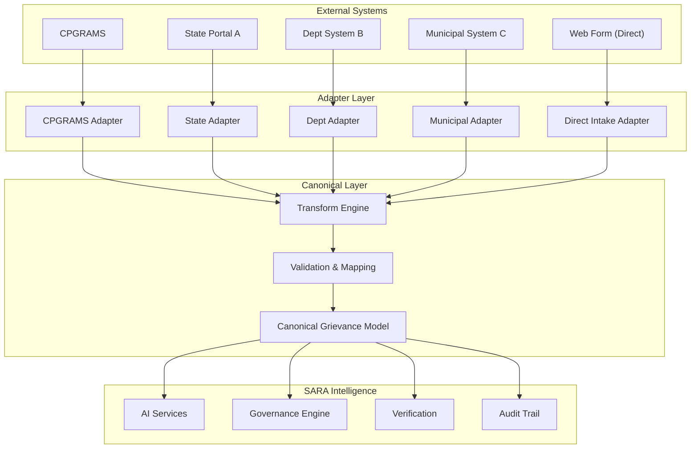
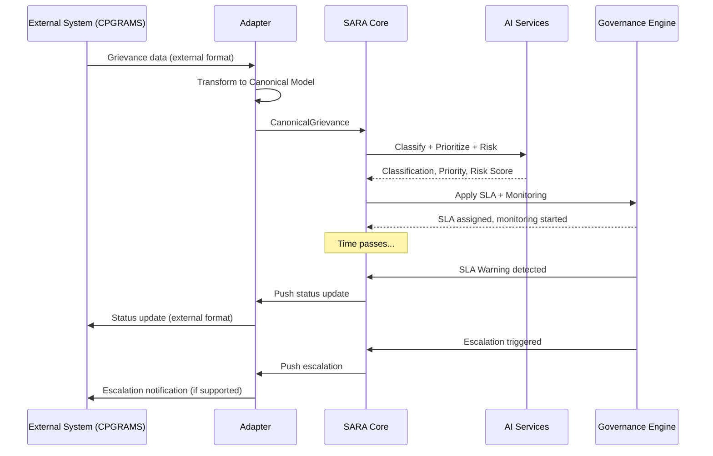

# Interoperability Architecture

## Design Philosophy

SARA is designed as an **integration layer**, not a replacement for existing systems. The architecture uses an adapter pattern that allows SARA to:

1. **Ingest** grievances from external systems
2. **Normalize** them into a canonical model
3. **Apply** accountability intelligence
4. **Push** insights/actions back to external systems

## Architecture



## Adapter Interface

Every external system adapter implements a standard interface:

```python
from abc import ABC, abstractmethod
from typing import Optional
from app.modules.integrations.canonical import CanonicalGrievance

class GrievanceAdapter(ABC):
    """Abstract interface for external grievance system integration."""

    @abstractmethod
    async def fetch_grievance(self, external_id: str) -> CanonicalGrievance:
        """Fetch a grievance from the external system and normalize it."""
        ...

    @abstractmethod
    async def push_status_update(self, external_id: str, status: str, metadata: dict) -> bool:
        """Push a status update back to the external system."""
        ...

    @abstractmethod
    async def push_escalation(self, external_id: str, escalation_data: dict) -> bool:
        """Notify the external system of an escalation."""
        ...

    @abstractmethod
    async def sync_grievances(self, since: datetime) -> list[CanonicalGrievance]:
        """Batch sync grievances modified since a timestamp."""
        ...

    @abstractmethod
    def get_source_system_name(self) -> str:
        """Return the identifier for this source system."""
        ...
```

## Canonical Grievance Model

The canonical model is SARA's internal normalized representation. All external grievance formats are mapped to this model.

```python
@dataclass
class CanonicalGrievance:
    # Identity
    sara_id: Optional[str]          # SARA's internal ID
    source_system: str               # "cpgrams", "state_portal_ap", etc.
    external_id: str                 # ID in the source system

    # Complainant (anonymized reference)
    citizen_reference: str           # Pseudonymized citizen identifier

    # Complaint details
    description: str                 # Full complaint text
    category: Optional[str]         # Category (may be reclassified by SARA AI)
    original_category: Optional[str] # Category assigned by source system
    priority: Optional[str]         # Priority (may be reassessed by SARA)
    original_priority: Optional[str] # Priority from source system

    # Location
    location_text: Optional[str]    # Free-text location
    latitude: Optional[float]       # GPS coordinates if available
    longitude: Optional[float]

    # Assignment
    department: Optional[str]
    assigned_officer_reference: Optional[str]

    # Status
    status: str                     # Mapped to SARA state machine
    original_status: Optional[str]  # Raw status from source system

    # Timestamps
    created_at: datetime
    updated_at: datetime
    sla_deadline: Optional[datetime]

    # Metadata
    attachments: list[str]          # File references
    metadata: dict                  # System-specific extra fields
```

## Status Mapping

Each adapter defines how source system statuses map to SARA states:

```python
# Example: CPGRAMS adapter status mapping
CPGRAMS_STATUS_MAP = {
    "Received": "SUBMITTED",
    "Under Process": "IN_PROGRESS",
    "Disposed": "RESOLUTION_SUBMITTED",  # NOT "CLOSED" — SARA verifies
    "Transferred": "ROUTED",
    "Appealed": "REOPENED",
}
```

> [!IMPORTANT]
> A grievance marked as "Disposed" in CPGRAMS maps to `RESOLUTION_SUBMITTED` in SARA, not `CLOSED`. This is intentional — SARA's verification workflow evaluates the resolution before allowing closure.

## MVP Implementation

### Direct Intake Adapter (Primary for MVP)

For the MVP, the primary intake method is SARA's own web form. This is the "Direct Intake Adapter":

```python
class DirectIntakeAdapter(GrievanceAdapter):
    """Adapter for grievances submitted directly through SARA's web form."""

    async def fetch_grievance(self, external_id: str) -> CanonicalGrievance:
        # Direct submissions are already in canonical form
        return self.repository.get(external_id)

    def get_source_system_name(self) -> str:
        return "sara_direct"
```

### Simulated CPGRAMS Adapter (For Demo)

A simulated adapter demonstrates interoperability without requiring real CPGRAMS API access:

```python
class SimulatedCPGRAMSAdapter(GrievanceAdapter):
    """Simulated CPGRAMS adapter for demonstration purposes."""

    async def fetch_grievance(self, external_id: str) -> CanonicalGrievance:
        # Returns synthetic CPGRAMS-formatted data, normalized to canonical model
        raw = self.simulated_data.get(external_id)
        return self.transform(raw)

    async def push_status_update(self, external_id: str, status: str, metadata: dict) -> bool:
        # Log the push (simulated)
        logger.info(f"[SIMULATED] Push to CPGRAMS: {external_id} → {status}")
        return True

    def get_source_system_name(self) -> str:
        return "cpgrams_simulated"
```

## Future Integration Path

When real CPGRAMS API access is available (through NIC/DARPG authorization):

1. Implement `CPGRAMSAdapter` using their RESTful API
2. Configure authentication (API keys from NIC)
3. Map CPGRAMS data fields to canonical model
4. Set up bidirectional sync (pull grievances, push insights)
5. Handle CPGRAMS-specific statuses and workflows

The adapter interface ensures this is a **configuration change**, not an architecture rewrite.

## Data Flow for Interoperable Grievance



## Integration Registry

Administrators manage integrations through a registry:

| Field | Description |
|---|---|
| `integration_id` | Unique identifier |
| `source_system` | System name (e.g., "cpgrams") |
| `adapter_type` | Adapter class to use |
| `config` | Connection configuration (encrypted) |
| `status_mapping` | Custom status field mappings |
| `sync_enabled` | Whether periodic sync is active |
| `sync_interval_minutes` | Sync frequency |
| `last_sync_at` | Timestamp of last successful sync |
| `is_active` | Whether integration is active |
