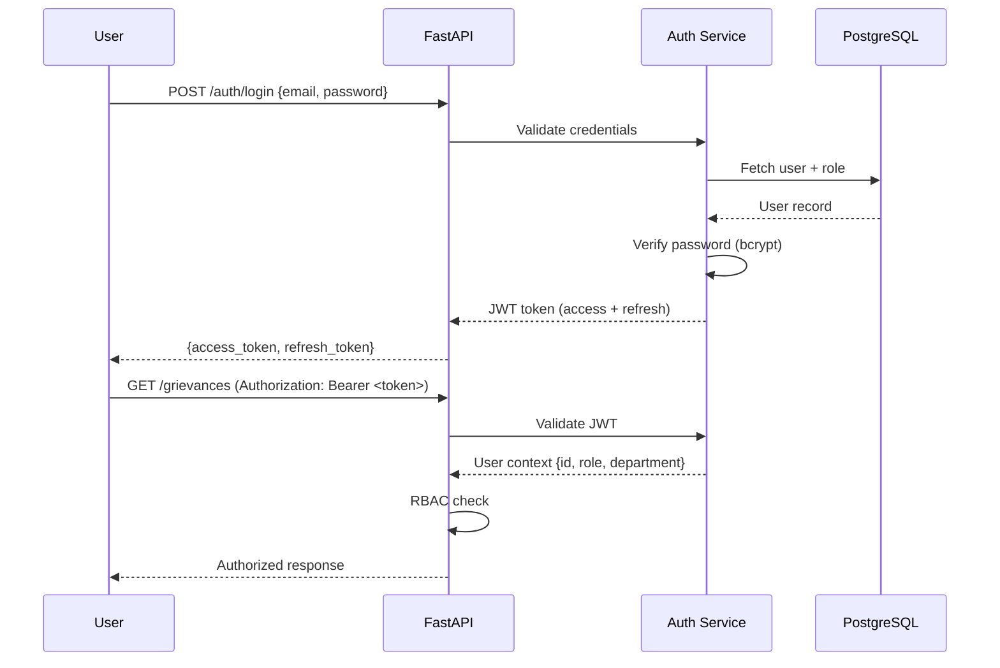
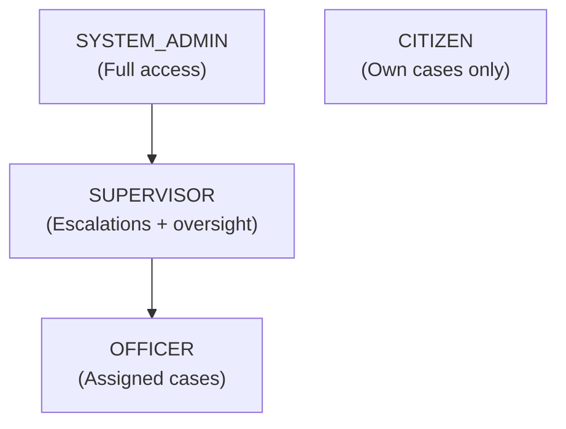

# Security Architecture

## Threat Model

SARA processes public grievance data, which includes:
- Citizen personal information (name, contact, location)
- Complaint descriptions (potentially sensitive)
- Government officer information
- Administrative actions and accountability records

### Threat Categories

| Category | Threats | Severity |
|---|---|---|
| Authentication | Credential theft, brute force, session hijacking | 🔴 Critical |
| Authorization | Privilege escalation, RBAC bypass, cross-role data access | 🔴 Critical |
| AI Security | Prompt injection, data exfiltration via AI, hallucinated actions | 🔴 Critical |
| Data Privacy | PII exposure, unauthorized data access, audit log tampering | 🔴 Critical |
| Input Validation | SQL injection, XSS, file upload attacks | 🟠 High |
| API Security | Rate limiting bypass, mass data scraping, CSRF | 🟠 High |
| Infrastructure | Secrets exposure, container escape, dependency vulnerabilities | 🟠 High |

## Authentication

### JWT-Based Stateless Authentication



### Token Specifications

| Parameter | Value |
|---|---|
| Algorithm | HS256 (MVP) / RS256 (production) |
| Access token expiry | 30 minutes |
| Refresh token expiry | 7 days |
| Password hashing | bcrypt (12 rounds) |
| Token storage | Client-side (httpOnly cookie preferred, localStorage acceptable for MVP) |

## Role-Based Access Control (RBAC)

### Role Hierarchy



### Permission Matrix

| Resource | Action | CITIZEN | OFFICER | SUPERVISOR | ADMIN |
|---|---|---|---|---|---|
| Grievance | Create | ✅ (own) | ❌ | ❌ | ✅ |
| Grievance | Read | ✅ (own) | ✅ (assigned) | ✅ (dept) | ✅ (all) |
| Grievance | Update status | ❌ | ✅ (assigned) | ✅ (dept) | ✅ (all) |
| Grievance | Reassign | ❌ | ❌ | ✅ (dept) | ✅ (all) |
| Evidence | Upload | ✅ (own) | ✅ (assigned) | ❌ | ✅ |
| Evidence | View | ✅ (own) | ✅ (assigned) | ✅ (dept) | ✅ (all) |
| Verification | Confirm/Reject | ✅ (own) | ❌ | ❌ | ❌ |
| Dossier | View | ❌ | ❌ | ✅ (dept) | ✅ (all) |
| SLA Policy | CRUD | ❌ | ❌ | ❌ | ✅ |
| Escalation Policy | CRUD | ❌ | ❌ | ❌ | ✅ |
| Users | CRUD | ❌ | ❌ | ❌ | ✅ |
| Departments | CRUD | ❌ | ❌ | ❌ | ✅ |
| Audit Logs | View | ❌ | ❌ | ✅ (dept) | ✅ (all) |
| Analytics | View | ❌ | ✅ (own) | ✅ (dept) | ✅ (all) |
| Notifications | Read | ✅ (own) | ✅ (own) | ✅ (own) | ✅ (own) |

### RBAC Implementation

```python
# Decorator-based RBAC enforcement
@router.get("/grievances/{id}/dossier")
@require_roles(["SUPERVISOR", "ADMIN"])
@require_department_access  # Supervisor can only see own department
async def get_dossier(id: str, current_user: User = Depends(get_current_user)):
    ...
```

## Input Validation

### API Layer

| Validation | Implementation |
|---|---|
| Request schema validation | Pydantic models with strict types |
| String length limits | Max lengths on all text fields |
| Enum validation | Status, priority, category from defined enums |
| File upload validation | MIME type whitelist, max size, virus scan (post-MVP) |
| SQL injection prevention | SQLAlchemy parameterized queries (never raw SQL) |
| XSS prevention | HTML stripping on all text inputs |
| Path traversal prevention | Controlled file paths, no user-supplied paths |

### File Upload Security

```python
ALLOWED_MIME_TYPES = {
    "image/jpeg", "image/png", "image/webp",
    "application/pdf",
    "application/msword",
    "application/vnd.openxmlformats-officedocument.wordprocessingml.document"
}
MAX_FILE_SIZE_MB = 10
MAX_FILES_PER_GRIEVANCE = 5

async def validate_upload(file: UploadFile):
    # Check MIME type
    if file.content_type not in ALLOWED_MIME_TYPES:
        raise HTTPException(400, "File type not allowed")

    # Check size
    content = await file.read()
    if len(content) > MAX_FILE_SIZE_MB * 1024 * 1024:
        raise HTTPException(400, "File too large")

    # Reset file position
    await file.seek(0)

    # Rename to prevent path traversal
    safe_filename = f"{uuid4()}.{get_extension(file.filename)}"
    return safe_filename, content
```

## AI Security

### Prompt Injection Protection

```python
class PromptSanitizer:
    INJECTION_PATTERNS = [
        r"ignore\s+(previous|above|all)\s+instructions",
        r"system\s*prompt",
        r"you\s+are\s+now",
        r"act\s+as\s+",
        r"forget\s+(everything|all)",
        r"<\s*(script|img|iframe)",
        r"\\n\\n.*instruction",
    ]

    def sanitize(self, text: str) -> tuple[str, bool]:
        """Returns (sanitized_text, was_injection_detected)."""
        cleaned = self.strip_html(text)
        cleaned = self.strip_control_chars(cleaned)

        injection_detected = False
        for pattern in self.INJECTION_PATTERNS:
            if re.search(pattern, cleaned, re.IGNORECASE):
                injection_detected = True
                cleaned = re.sub(pattern, "[REDACTED]", cleaned, flags=re.IGNORECASE)

        return cleaned, injection_detected
```

### LLM Output Validation

```python
class LLMOutputValidator:
    def validate_classification(self, output: dict) -> bool:
        """Ensure classification output matches expected schema."""
        return (
            "category" in output
            and output["category"] in VALID_CATEGORIES
            and "confidence" in output
            and 0 <= output["confidence"] <= 1
        )

    def validate_summary(self, summary: str) -> bool:
        """Ensure summary is safe and within bounds."""
        return (
            len(summary) <= 300
            and not contains_urls(summary)
            and not contains_code_patterns(summary)
            and not contains_system_references(summary)
        )
```

## Data Privacy & PII Protection

### PII Handling

| Data Type | Storage | Access | Display |
|---|---|---|---|
| Citizen name | Encrypted at rest | Auth required | Full name to own citizen, anonymized to others |
| Citizen email | Encrypted at rest | Auth required | Not displayed to officers (only notification system) |
| Citizen phone | Encrypted at rest | Auth required | Not exposed via API |
| Location | Stored as coordinates | Auth required | Shown to assigned officer + supervisor |
| Complaint text | Stored as-is | RBAC-controlled | Visible to assigned officer, supervisor, admin |
| Officer name | Stored as-is | RBAC-controlled | Visible to citizen (role only), supervisor (full) |

### Data Exposure Rules

- Citizens NEVER see other citizens' data
- Officers ONLY see grievances assigned to them
- Supervisors see all grievances in their department
- Admins see everything
- Audit logs are accessible to supervisors (dept) and admins (all)
- **No endpoint returns data for unauthorized scope**

## Audit Logging

### Audit Log Structure

```json
{
  "audit_id": "uuid",
  "timestamp": "ISO-8601",
  "actor_id": "uuid",
  "actor_role": "OFFICER",
  "action": "STATUS_UPDATE",
  "resource_type": "grievance",
  "resource_id": "uuid",
  "previous_state": {"status": "ASSIGNED"},
  "new_state": {"status": "ACKNOWLEDGED"},
  "reason": "Officer acknowledged receipt",
  "ip_address": "x.x.x.x",
  "source": "api"
}
```

### Audit Integrity

| Principle | Implementation |
|---|---|
| Append-only | INSERT only, no UPDATE or DELETE on audit tables |
| Tamper detection | Sequential audit IDs + timestamps (hash chain in production) |
| Comprehensive | Every state change, policy change, auth event logged |
| Retention | Audit logs retained indefinitely (configurable) |
| Access control | Officers cannot view/modify audit logs; supervisors read-only |

## API Security

| Measure | Implementation |
|---|---|
| HTTPS | TLS termination at reverse proxy (Nginx) |
| Rate limiting | Per-user, per-endpoint limits (e.g., 100 req/min) |
| CORS | Whitelist frontend origin only |
| Request size limit | 10MB max payload |
| API versioning | `/api/v1/` prefix |
| Error handling | Generic error messages (no stack traces in production) |
| Request ID | UUID per request for tracing |

## Secrets Management

| Secret | Storage | MVP Approach |
|---|---|---|
| Database credentials | Environment variable | `.env` file (gitignored) |
| JWT secret key | Environment variable | `.env` file |
| LLM API keys | Environment variable | `.env` file |
| Redis password | Environment variable | `.env` file |
| File encryption keys | Environment variable | `.env` file |

> [!WARNING]
> `.env` files must NEVER be committed to version control. `.env.example` with placeholder values should be provided instead.
