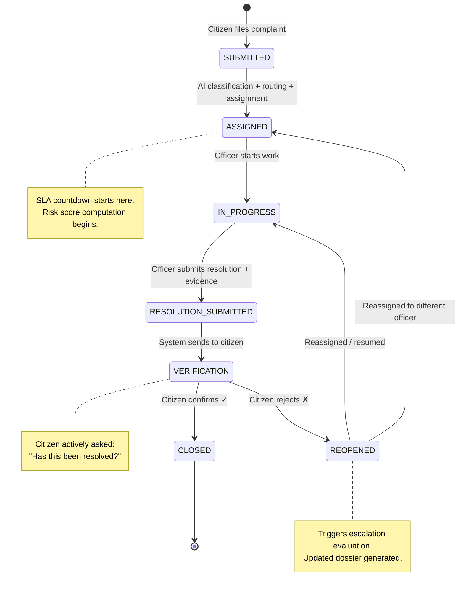
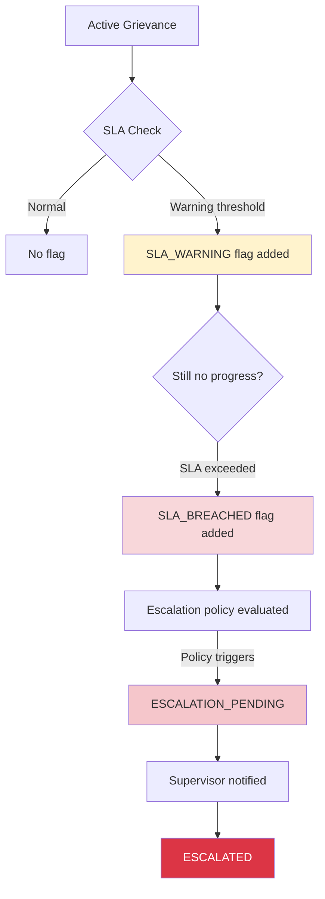

# Grievance State Machine

## Design Principles

1. **Explicit states**: Every grievance occupies exactly one of the 7 primary lifecycle states at any time.
2. **Controlled transitions**: Only valid transitions are allowed; invalid ones are rejected.
3. **Event emission**: Every state transition, classification, or routing action emits an immutable event record.
4. **Guard conditions**: Transitions may have pre-conditions (e.g., evidence required for RESOLUTION_SUBMITTED).
5. **Deterministic**: State transitions are governed by rules, not AI.

## State Definitions

| State | Description | Entry Condition |
|---|---|---|
| `SUBMITTED` | Grievance filed by citizen | Citizen submits complaint form |
| `ASSIGNED` | Specific officer assigned | Officer assignment (auto or manual) |
| `IN_PROGRESS` | Officer is actively working on it | Officer marks work started |
| `RESOLUTION_SUBMITTED` | Officer claims resolution with evidence | Officer submits resolution + evidence |
| `VERIFICATION` | Awaiting citizen verification | System sends verification to citizen |
| `CLOSED` | Grievance verified and closed | Citizen confirms resolution |
| `REOPENED` | Citizen rejected resolution or new issue | Citizen rejects or case merit requires |

### State Category Separation

SARA strictly separates four categories of state-related concepts:

#### Category 1: Grievance Lifecycle States (Primary — mutually exclusive)

These represent where the grievance is in its workflow. A grievance occupies exactly ONE lifecycle state at any time.

| `SUBMITTED` | System | Initial state upon citizen submission. AI classification and routing happen here without state change. |
| `ASSIGNED` | System/Admin | Officer assigned; SLA clock starts. |
| `IN_PROGRESS` | Officer | Active work underway. Officer can flag 'Waiting for Info/Resource' without changing lifecycle state. |
| `RESOLUTION_SUBMITTED` | Officer | Resolution claimed with evidence. |
| `VERIFICATION` | System | Awaiting citizen confirmation. |
| `CLOSED` | Citizen/Supervisor | Verified and closed. |
| `REOPENED` | Citizen/Supervisor | Rejected or merit-based reopen. |

#### Category 2: SLA Events (Temporal flags — set alongside primary state)

These are NOT states. They are event-driven flags that augment the primary state. A grievance can be `IN_PROGRESS` AND have `SLA_WARNING` active simultaneously.

| Flag | Trigger | Effect |
|---|---|---|
| `SLA_WARNING` | Configurable threshold (e.g., 50% of SLA consumed) | Notification to officer; supervisor alerted |
| `SLA_BREACHED` | SLA deadline exceeded without resolution | Triggers escalation policy evaluation |

#### Category 3: Escalation Events (Action-driven flags — set alongside primary state)

These track escalation lifecycle and are also NOT primary states.

| Flag | Trigger | Effect |
|---|---|---|
| `ESCALATION_PENDING` | Governance engine evaluates escalation conditions | Dossier generation initiated |
| `ESCALATED` | Escalation policy confirmed and supervisor notified | Case visible on supervisor dashboard |

#### Category 4: Governance Events (System-generated, audit-logged)

These are logged events emitted by the governance engine. They do NOT change the primary state but create immutable event records.

| Event | Generator | Purpose |
|---|---|---|
| `REMINDER_SENT` | Reminder Engine | Officer prompted to act |
| `SLA_WARNING` | SLA Monitor | Warning threshold reached |
| `SLA_BREACH` | SLA Monitor | Deadline exceeded |
| `RISK_DETECTED` | Risk Engine | Risk score crossed threshold |
| `ESCALATION_TRIGGERED` | Escalation Engine | Policy-driven escalation initiated |
| `DOSSIER_GENERATED` | Dossier Generator | Accountability dossier created |

> [!IMPORTANT]
> **Lifecycle states** are mutually exclusive and tracked in `grievances.status`. **SLA/escalation flags** are tracked in dedicated boolean/integer columns (`is_escalated`, `escalation_level`) and event records. **Governance events** are logged in `grievance_events` but do NOT change `grievances.status`.

## State Machine Diagram



## Transition Rules

### Valid Transitions Matrix

| From State | To State | Actor | Guard Conditions |
|---|---|---|---|
| `SUBMITTED` | `ASSIGNED` | System / Admin | AI classification & routing complete; Officer available |
| `ASSIGNED` | `IN_PROGRESS` | Officer | Officer explicitly starts work |
| `IN_PROGRESS` | `RESOLUTION_SUBMITTED` | Officer | Evidence uploaded, resolution notes provided |
| `RESOLUTION_SUBMITTED` | `VERIFICATION` | System | Verification request sent to citizen |
| `VERIFICATION` | `CLOSED` | Citizen | Citizen confirms resolution |
| `VERIFICATION` | `REOPENED` | Citizen | Citizen rejects resolution |
| `REOPENED` | `IN_PROGRESS` | Officer | Same officer resumes |
| `REOPENED` | `ASSIGNED` | Admin / System | Different officer assigned |

### Automated Transitions

These transitions happen without user interaction:

| Transition | Trigger | Timing |
|---|---|---|
| `SUBMITTED` → `ASSIGNED` | AI classification & routing completes | Immediate (async) |
| `RESOLUTION_SUBMITTED` → `VERIFICATION` | System generates verification request | Immediate |

### Supervisor Override Transitions

Supervisors can force certain transitions:

| Transition | Condition |
|---|---|
| Any state → `ASSIGNED` | Supervisor reassigns to different officer |
| Any state → `CLOSED` | Supervisor closes with documented reason |
| `CLOSED` → `REOPENED` | Supervisor reopens with reason |

## Escalation State Overlay

Escalation flags are applied as metadata alongside the primary state. They do not replace the primary state.



## Events Emitted per Transition

Every state transition emits an event record with this structure:

```json
{
  "event_id": "uuid",
  "grievance_id": "uuid",
  "event_type": "OFFICER_ACKNOWLEDGED",
  "from_state": "ASSIGNED",
  "to_state": "ACKNOWLEDGED",
  "actor_id": "uuid",
  "actor_role": "OFFICER",
  "timestamp": "ISO-8601",
  "metadata": {
    "remarks": "Will inspect site tomorrow morning"
  }
}
```

### Complete Event Type Catalog

| Event Type | Emitted When |
|---|---|
| `GRIEVANCE_CREATED` | Citizen submits complaint |
| `GRIEVANCE_CLASSIFIED` | AI classification completes |
| `GRIEVANCE_ROUTED` | Department identified |
| `OFFICER_ASSIGNED` | Officer assigned to case |
| `ACTION_STARTED` | Officer begins work |
| `ACTION_UPDATED` | Officer posts progress update |
| `INFORMATION_REQUESTED` | Officer flags need for more info from citizen |
| `INFORMATION_PROVIDED` | Citizen provides requested info |
| `RESOURCE_REQUESTED` | Officer flags resource dependency |
| `RESOURCE_ALLOCATED` | Resource becomes available |
| `REMINDER_SENT` | System sends reminder to officer |
| `SLA_WARNING` | SLA warning threshold reached |
| `SLA_BREACH` | SLA deadline exceeded |
| `RISK_DETECTED` | Risk score exceeds threshold |
| `ESCALATION_TRIGGERED` | Policy engine triggers escalation |
| `EVIDENCE_UPLOADED` | Officer uploads resolution evidence |
| `RESOLUTION_SUBMITTED` | Officer submits resolution claim |
| `VERIFICATION_REQUESTED` | System asks citizen to verify |
| `CITIZEN_CONFIRMED` | Citizen confirms resolution |
| `CITIZEN_REJECTED` | Citizen rejects resolution |
| `GRIEVANCE_REOPENED` | Grievance reopened (any reason) |
| `GRIEVANCE_CLOSED` | Grievance verified and closed |
| `GRIEVANCE_REASSIGNED` | Officer changed |
| `SUPERVISOR_OVERRIDE` | Supervisor forces a state change |
| `DOSSIER_GENERATED` | Accountability dossier created |

## Implementation Notes

### State Machine Implementation

The state machine should be implemented as a dedicated module, not scattered across controllers:

```python
# Conceptual structure
class GrievanceStateMachine:
    TRANSITIONS = {
        "SUBMITTED": ["ASSIGNED"],
        "ASSIGNED": ["IN_PROGRESS"],
        "IN_PROGRESS": [
            "RESOLUTION_SUBMITTED"
        ],
        "RESOLUTION_SUBMITTED": ["VERIFICATION"],
        "VERIFICATION": ["CLOSED", "REOPENED"],
        "REOPENED": ["IN_PROGRESS", "ASSIGNED"],
    }

    def can_transition(self, from_state, to_state, actor_role):
        # Check valid transition + RBAC
        ...

    def transition(self, grievance, to_state, actor, metadata):
        # Validate → transition → emit event → return
        ...
```

### Guard Condition Examples

| Transition | Guard |
|---|---|
| → `RESOLUTION_SUBMITTED` | At least one evidence file uploaded AND resolution notes provided |
| → `CLOSED` (by citizen) | Citizen explicitly confirmed |
| → `CLOSED` (by supervisor) | Override reason documented |
| → `ESCALATED` | Escalation policy rule evaluated as TRUE |
