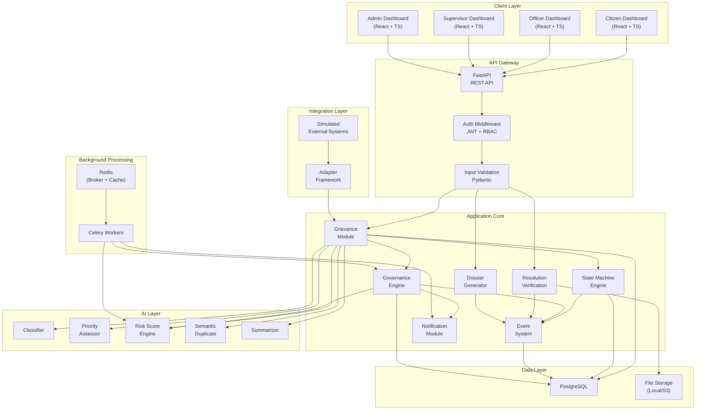
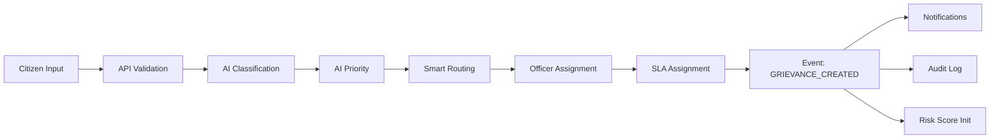
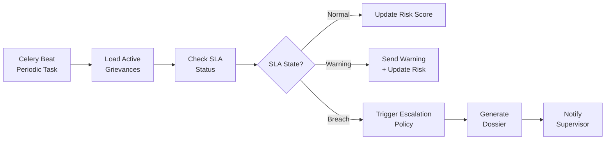
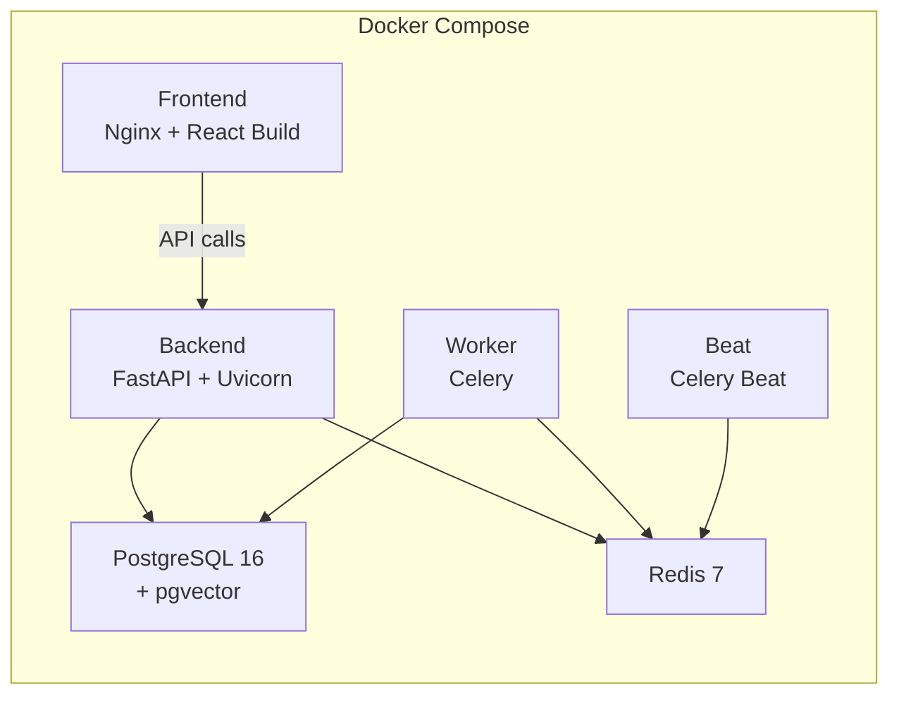

# System Architecture

## Architecture Philosophy

SARA follows a **modular monolith** architecture for MVP. All services run in a single deployable unit but are organized into clearly separated modules with well-defined interfaces, making future decomposition into microservices straightforward if scaling demands it.

**Why not microservices for MVP?**
- Reduces operational complexity for a hackathon demo
- Faster development cycle
- Single deployment target (Docker Compose)
- Module boundaries are enforced in code; decomposition is a deployment decision, not an architectural rewrite

## High-Level Architecture



## Module Breakdown

### 1. API Layer (`/api`)

| Component | Purpose |
|---|---|
| Routes | REST endpoint definitions per resource |
| Auth Middleware | JWT token validation, role extraction |
| RBAC Guards | Per-endpoint role-based access control |
| Input Validation | Pydantic models for request/response schemas |
| Error Handling | Consistent error response format |
| Rate Limiting | Request throttling per user/role |

### 2. Grievance Module (`/modules/grievance`)

| Component | Purpose |
|---|---|
| Service | Business logic for grievance CRUD |
| Repository | Database access layer (SQLAlchemy) |
| State Machine | Grievance state transition logic |
| Router | Smart routing engine (department resolution) |

### 3. State Machine Engine (`/modules/state_machine`)

| Component | Purpose |
|---|---|
| State Definitions | All valid states and allowed transitions |
| Transition Validator | Enforces valid state transitions |
| Event Emitter | Emits events on every transition |
| Guard Conditions | Pre-conditions for transitions |

### 4. Event System (`/modules/events`)

| Component | Purpose |
|---|---|
| Event Bus | Internal pub/sub for domain events |
| Event Store | Immutable event log in PostgreSQL |
| Event Handlers | React to events (update risk scores, trigger policies) |

### 5. Governance Engine (`/modules/governance`)

| Component | Purpose |
|---|---|
| SLA Monitor | Checks SLA status for all active grievances |
| Policy Engine | Evaluates deterministic escalation rules |
| Reminder Engine | Generates and dispatches reminders |
| Escalation Engine | Triggers and tracks escalations |
| Policy Configuration | CRUD for SLA and escalation policies |

### 6. AI Layer (`/modules/ai`)

| Component | Purpose |
|---|---|
| Classifier | Category prediction with confidence |
| Priority Assessor | Multi-signal urgency scoring |
| Risk Scorer | Accountability Risk Score computation |
| Duplicate Detector | Semantic similarity via embeddings |
| Summarizer | Complaint text summarization |
| Prompt Safety | Input sanitization before AI processing |

### 7. Resolution Verification (`/modules/verification`)

| Component | Purpose |
|---|---|
| Evidence Manager | File upload, metadata extraction, storage |
| Verification Workflow | Citizen confirmation/rejection flow |
| Evidence Analyzer | AI-assisted evidence quality signals |

### 8. Notification Module (`/modules/notifications`)

| Component | Purpose |
|---|---|
| In-App Notifications | Real-time notification storage and retrieval |
| Notification Templates | Configurable message templates |
| Dispatcher | Route notifications to appropriate channels |

### 9. Dossier Generator (`/modules/dossier`)

| Component | Purpose |
|---|---|
| Dossier Builder | Aggregates case data into structured report |
| Timeline Generator | Chronological event history |
| Risk Explainer | Factor-by-factor risk breakdown |

### 10. Integration Layer (`/modules/integrations`)

| Component | Purpose |
|---|---|
| Adapter Interface | Abstract interface for external systems |
| CPGRAMS Adapter | Simulated CPGRAMS connector |
| Canonical Model | Normalized grievance representation |

## Data Flow

### Grievance Submission Flow



### SLA Monitoring Flow (Background)



## Technology Stack

| Layer | Technology | Justification |
|---|---|---|
| Frontend | React 18 + TypeScript | Type safety, component model, SIH presentation quality |
| Styling | Tailwind CSS | Rapid development, consistent design tokens |
| State management | React Context + TanStack Query | Simple, avoids Redux complexity for MVP |
| Backend | Python 3.11 + FastAPI | Async, typed, OpenAPI docs, AI ecosystem |
| ORM | SQLAlchemy 2.0 | Mature, typed, async support |
| Migrations | Alembic | Standard SQLAlchemy migration tool |
| Database | PostgreSQL 16 | Relational integrity, pgvector, JSON support |
| Vector search | pgvector (PostgreSQL extension) | Semantic duplicate detection, no separate DB needed |
| Caching/Broker | Redis 7 | Celery broker + response caching |
| Background tasks | Celery 5 | SLA monitoring, risk computation, reminders |
| AI - Classification | scikit-learn | Lightweight, local, sufficient for MVP |
| AI - Embeddings | sentence-transformers | Local vector embeddings for duplicate detection |
| AI - Summarization | Gemini API (or local Ollama model) | Placed behind an interface for provider swapping |
| File storage | Local filesystem (MVP) | S3-compatible in production |
| Auth | JWT (PyJWT) + bcrypt | Stateless, secure, standard |
| Deployment | Docker Compose | Single-command demo deployment |

## Directory Structure (Proposed)

```
sara/
├── docker-compose.yml
├── .env.example
├── docs/                          # Documentation (this folder)
│
├── backend/
│   ├── Dockerfile
│   ├── pyproject.toml
│   ├── alembic/                   # Database migrations
│   ├── app/
│   │   ├── main.py                # FastAPI application entry
│   │   ├── config.py              # Configuration management
│   │   ├── database.py            # Database connection
│   │   │
│   │   ├── api/                   # API layer
│   │   │   ├── routes/            # Route definitions per resource
│   │   │   ├── middleware/        # Auth, RBAC, rate limiting
│   │   │   └── schemas/           # Pydantic request/response models
│   │   │
│   │   ├── models/                # SQLAlchemy ORM models
│   │   │
│   │   ├── modules/
│   │   │   ├── grievance/         # Grievance business logic
│   │   │   ├── state_machine/     # State transition engine
│   │   │   ├── events/            # Event system
│   │   │   ├── governance/        # SLA + escalation policies
│   │   │   ├── ai/                # All AI services
│   │   │   ├── verification/      # Resolution verification
│   │   │   ├── notifications/     # Notification system
│   │   │   ├── dossier/           # Accountability dossier
│   │   │   └── integrations/      # External system adapters
│   │   │
│   │   ├── core/                  # Shared utilities
│   │   │   ├── security.py        # Auth, JWT, password hashing
│   │   │   ├── exceptions.py      # Custom exceptions
│   │   │   └── constants.py       # Enums, constants
│   │   │
│   │   └── tests/                 # Test suite
│   │       ├── unit/
│   │       ├── integration/
│   │       └── fixtures/
│   │
│   └── data/
│       ├── seed/                  # Seed data for demo
│       └── models/                # Trained AI model artifacts
│
├── frontend/
│   ├── Dockerfile
│   ├── package.json
│   ├── tsconfig.json
│   ├── src/
│   │   ├── App.tsx
│   │   ├── main.tsx
│   │   ├── api/                   # API client layer
│   │   ├── components/            # Shared UI components
│   │   ├── pages/                 # Page-level components
│   │   │   ├── citizen/
│   │   │   ├── officer/
│   │   │   ├── supervisor/
│   │   │   └── admin/
│   │   ├── hooks/                 # Custom React hooks
│   │   ├── context/               # React context providers
│   │   ├── types/                 # TypeScript type definitions
│   │   └── utils/                 # Shared utilities
│   │
│   └── public/
│
└── scripts/
    ├── seed_db.py                 # Database seeding
    ├── generate_synthetic_data.py # Synthetic data generator
    └── demo_simulation.py         # Secure demo time-fast-forward script
```

## Deployment Architecture (MVP)



## Key Design Decisions

| Decision | Choice | Rationale |
|---|---|---|
| Monolith vs. microservices | Modular monolith | Faster development, simpler ops, same code boundaries |
| State management | Explicit state machine with event sourcing | Auditability, deterministic behavior |
| AI decisions vs. policy decisions | Separated | AI recommends, governance engine decides deterministically |
| SLA monitoring | Background periodic task | Scalable, non-blocking, configurable frequency |
| File storage | Local filesystem for MVP | Simplest; interface abstracts to S3 later |
| Vector search | pgvector in PostgreSQL | No additional infrastructure; sufficient for MVP scale |
| Frontend routing | Client-side (React Router) | SPA experience, role-based route guards |
