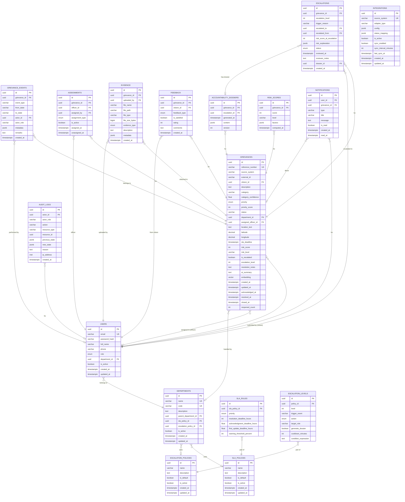

# Database — Entity Relationship Diagram

## Full ERD

## Relationship Summary

| Parent | Child | Relationship | Cardinality |
|---|---|---|---|
| users | grievances | Citizen submits | 1:N |
| users | assignments | Officer assigned | 1:N |
| users | notifications | Receives | 1:N |
| departments | users | Officers belong to | 1:N |
| departments | grievances | Handles | 1:N |
| departments | sla_policies | Uses | N:1 |
| departments | escalation_policies | Uses | N:1 |
| grievances | grievance_events | Has events | 1:N |
| grievances | assignments | Has assignments | 1:N |
| grievances | evidence | Has evidence | 1:N |
| grievances | feedback | Has feedback | 1:N |
| grievances | escalations | Has escalations | 1:N |
| grievances | risk_scores | Has score history | 1:N |
| grievances | accountability_dossiers | Has dossiers | 1:N |
| sla_policies | sla_rules | Contains | 1:N |
| escalation_policies | escalation_levels | Contains | 1:N |
| escalations | accountability_dossiers | Generates | 1:1 |
