# Implementation Roadmap

## Overview

Development is organized into **8 milestones**, each building on the previous one. Every milestone produces a testable, demonstrable increment.

**Estimated total effort**: 12–16 development days for a focused team.

---

## Milestone 1: Project Foundation

**Objective**: Establish project structure, development environment, and base infrastructure.

**Duration**: 1–2 days

### Deliverables

| Task | Files/Services |
|---|---|
| Backend project setup | `backend/pyproject.toml`, `backend/app/main.py`, `backend/app/config.py` |
| FastAPI application scaffold | `backend/app/main.py` with CORS, middleware, health endpoint |
| Database connection | `backend/app/database.py` (SQLAlchemy async) |
| Alembic setup | `backend/alembic/` with initial migration |
| Docker Compose | `docker-compose.yml` (PostgreSQL, Redis, backend, worker) |
| Environment config | `.env.example`, `backend/app/config.py` (Pydantic Settings) |
| Frontend project setup | `npx create-vite frontend --template react-ts` |
| Tailwind CSS setup | `frontend/tailwind.config.js`, `frontend/src/index.css` |
| API client scaffold | `frontend/src/api/client.ts` |

### Dependencies
None (first milestone)

### Acceptance Criteria
- [ ] `docker-compose up` starts PostgreSQL, Redis, backend
- [ ] `GET /api/v1/health` returns `{ status: "healthy" }`
- [ ] Frontend dev server starts with Vite
- [ ] Alembic migration runs successfully
- [ ] SQLAlchemy connects to PostgreSQL

---

## Milestone 2: Authentication & RBAC

**Objective**: Implement user management, JWT auth, and role-based access control.

**Duration**: 1–2 days

### Deliverables

| Task | Files/Services |
|---|---|
| User model | `backend/app/models/user.py` |
| Department model | `backend/app/models/department.py` |
| Auth service | `backend/app/core/security.py` (JWT, password hashing) |
| Auth routes | `backend/app/api/routes/auth.py` (register, login, refresh, me) |
| RBAC middleware | `backend/app/api/middleware/rbac.py` |
| User CRUD routes | `backend/app/api/routes/users.py` (admin only) |
| Department CRUD routes | `backend/app/api/routes/departments.py` |
| Pydantic schemas | `backend/app/api/schemas/auth.py`, `schemas/users.py` |
| Frontend auth pages | Login, register pages |
| Frontend auth context | `frontend/src/context/AuthContext.tsx` |
| Route guards | `frontend/src/components/ProtectedRoute.tsx` |

### Dependencies
Milestone 1

### Acceptance Criteria
- [ ] Citizen can register and login
- [ ] Admin can create officer/supervisor accounts
- [ ] JWT tokens issued on login, validated on requests
- [ ] RBAC enforced: citizens cannot access officer endpoints
- [ ] Password stored as bcrypt hash
- [ ] Frontend login flow works

---

## Milestone 3: Grievance CRUD & State Machine

**Objective**: Implement core grievance operations with explicit state machine.

**Duration**: 2–3 days

### Deliverables

| Task | Files/Services |
|---|---|
| Grievance model | `backend/app/models/grievance.py` |
| Event model | `backend/app/models/grievance_event.py` |
| Assignment model | `backend/app/models/assignment.py` |
| State machine engine | `backend/app/modules/state_machine/engine.py` |
| State definitions | `backend/app/modules/state_machine/states.py` |
| Event system | `backend/app/modules/events/service.py` |
| Grievance service | `backend/app/modules/grievance/service.py` |
| Grievance routes | `backend/app/api/routes/grievances.py` |
| Pydantic schemas | `backend/app/api/schemas/grievances.py` |
| Ref number generator | `backend/app/core/utils.py` |
| Citizen submission form | `frontend/src/pages/citizen/SubmitGrievance.tsx` |
| Grievance list view | `frontend/src/pages/citizen/GrievanceList.tsx` |
| Grievance detail view | `frontend/src/pages/citizen/GrievanceDetail.tsx` |
| Officer grievance list | `frontend/src/pages/officer/AssignedGrievances.tsx` |
| Status update UI | `frontend/src/pages/officer/GrievanceWorkspace.tsx` |

### Dependencies
Milestone 2

### Acceptance Criteria
- [ ] Citizen can create grievance (status: SUBMITTED)
- [ ] State machine enforces valid transitions only
- [ ] Invalid transitions return 400 error
- [ ] Every state transition creates immutable event record
- [ ] Citizen can view own grievances
- [ ] Officer can view assigned grievances
- [ ] Officer can update status (acknowledge, start progress, etc.)
- [ ] Event timeline visible on grievance detail

---

## Milestone 4: AI Engine

**Objective**: Implement AI classification, priority, risk scoring, duplicate detection, and summarization.

**Duration**: 2–3 days

### Deliverables

| Task | Files/Services |
|---|---|
| Synthetic training data | `backend/data/seed/training_data.json` (Realistic small dataset) |
| Classifier | `backend/app/modules/ai/classifier.py` |
| Model training script | `backend/scripts/train_classifier.py` |
| Priority assessor | `backend/app/modules/ai/priority.py` |
| Risk score engine | `backend/app/modules/ai/risk_scorer.py` |
| Duplicate detector | `backend/app/modules/ai/duplicate_detector.py` |
| Summarizer | `backend/app/modules/ai/summarizer.py` |
| Prompt sanitizer | `backend/app/modules/ai/safety.py` |
| AI service (orchestrator) | `backend/app/modules/ai/service.py` |
| Model artifacts | `backend/data/models/` (trained model files) |
| Integration with grievance creation | Auto-classify on submission |
| AI results display | Frontend: category badge, confidence, priority, summary |

### Dependencies
Milestone 3

### Acceptance Criteria
- [ ] Classification accuracy ≥ 85% on test set
- [ ] Every classification includes confidence score and alternatives
- [ ] Priority scoring shows factor-by-factor breakdown
- [ ] Risk score computed with 10 factors
- [ ] Duplicate detection finds semantically similar complaints
- [ ] Summarizer produces 2-3 sentence summary
- [ ] Prompt injection attempts detected and logged
- [ ] AI results visible on officer dashboard

---

## Milestone 5: Governance Engine (SLA + Escalation)

**Objective**: Implement configurable SLA monitoring, reminders, and policy-driven escalation.

**Duration**: 2–3 days

### Deliverables

| Task | Files/Services |
|---|---|
| SLA policy models | `backend/app/models/sla_policy.py` |
| Escalation policy models | `backend/app/models/escalation_policy.py` |
| SLA monitor (Celery task) | `backend/app/modules/governance/sla_monitor.py` |
| Escalation engine | `backend/app/modules/governance/escalation_engine.py` |
| Reminder engine | `backend/app/modules/governance/reminder_engine.py` |
| Policy configuration routes | `backend/app/api/routes/policies.py` |
| Notification model | `backend/app/models/notification.py` |
| Notification service | `backend/app/modules/notifications/service.py` |
| Notification routes | `backend/app/api/routes/notifications.py` |
| Celery beat schedule | `backend/app/celery_config.py` |
| Notification UI component | `frontend/src/components/NotificationBell.tsx` |
| SLA countdown UI | `frontend/src/components/SLACountdown.tsx` |
| Policy management UI (admin) | `frontend/src/pages/admin/PolicyConfig.tsx` |

### Dependencies
Milestone 4

### Acceptance Criteria
- [ ] SLA monitoring runs as periodic background task
- [ ] SLA_WARNING event emitted at configurable threshold
- [ ] SLA_BREACH event emitted when deadline exceeded
- [ ] Reminders sent to officers (in-app notifications)
- [ ] Escalation triggered by policy rules
- [ ] Policies configurable by admin via UI
- [ ] Notification bell shows unread count
- [ ] SLA countdown displayed on officer dashboard

---

## Milestone 6: Resolution Verification & Evidence

**Objective**: Implement evidence upload, resolution submission, citizen verification, and reopening.

**Duration**: 1–2 days

### Deliverables

| Task | Files/Services |
|---|---|
| Evidence model | `backend/app/models/evidence.py` |
| Feedback model | `backend/app/models/feedback.py` |
| Evidence service | `backend/app/modules/verification/evidence_service.py` |
| Verification workflow | `backend/app/modules/verification/verification_service.py` |
| Evidence upload routes | `backend/app/api/routes/evidence.py` |
| Resolve route | `backend/app/api/routes/grievances.py` (POST /resolve) |
| Verify route | `backend/app/api/routes/grievances.py` (POST /verify) |
| File storage service | `backend/app/core/file_storage.py` |
| Evidence upload UI | `frontend/src/pages/officer/EvidenceUpload.tsx` |
| Resolution form | `frontend/src/pages/officer/ResolveGrievance.tsx` |
| Verification UI | `frontend/src/pages/citizen/VerifyResolution.tsx` |

### Dependencies
Milestone 5

### Acceptance Criteria
- [ ] Officer can upload evidence files (MIME validated, size limited)
- [ ] Officer can submit resolution (requires evidence + notes)
- [ ] State transitions: IN_PROGRESS → RESOLUTION_SUBMITTED → VERIFICATION
- [ ] Citizen receives notification to verify
- [ ] Citizen can confirm (→ CLOSED) or reject (→ REOPENED)
- [ ] Rejection triggers escalation evaluation
- [ ] All evidence and feedback stored permanently

---

## Milestone 7: Accountability Dossier & Dashboards

**Objective**: Implement dossier generation and role-specific dashboards.

**Duration**: 2–3 days

### Deliverables

| Task | Files/Services |
|---|---|
| Dossier generator | `backend/app/modules/dossier/generator.py` |
| Dossier model | `backend/app/models/dossier.py` |
| Escalation model | `backend/app/models/escalation.py` |
| Dossier route | `backend/app/api/routes/dossier.py` |
| Dashboard routes | `backend/app/api/routes/dashboard.py` |
| Audit log routes | `backend/app/api/routes/audit.py` |
| Citizen dashboard | `frontend/src/pages/citizen/Dashboard.tsx` |
| Officer dashboard | `frontend/src/pages/officer/Dashboard.tsx` |
| Supervisor dashboard | `frontend/src/pages/supervisor/Dashboard.tsx` |
| Admin dashboard | `frontend/src/pages/admin/Dashboard.tsx` |
| Dossier view | `frontend/src/pages/supervisor/DossierView.tsx` |
| Timeline component | `frontend/src/components/GrievanceTimeline.tsx` |
| Risk score component | `frontend/src/components/RiskScoreCard.tsx` |
| Charts/metrics | `frontend/src/components/DashboardCharts.tsx` |

### Dependencies
Milestone 6

### Acceptance Criteria
- [ ] Accountability dossier generated on escalation
- [ ] Dossier contains: timeline, risk breakdown, warnings, evidence, feedback
- [ ] Supervisor dashboard shows escalated/overdue/high-risk cases
- [ ] Officer dashboard shows prioritized queue with AI summaries
- [ ] Citizen dashboard shows own grievances with status tracking
- [ ] Admin dashboard shows system-wide metrics
- [ ] All dashboards role-appropriate (no cross-role data leakage)

---

## Milestone 8: Demo, Testing & Polish

**Objective**: Synthetic data, demo simulation, end-to-end testing, and presentation polish.

**Duration**: 2–3 days

### Deliverables

| Task | Files/Services |
|---|---|
| Synthetic dataset generator | `backend/scripts/generate_synthetic_data.py` |
| Database seeder | `backend/scripts/seed_db.py` |
| Demo simulation script | `backend/scripts/demo_simulation.py` (secure fast-forward time for demo/admin) |
| Unit tests | `backend/app/tests/unit/` (state machine, governance, AI) |
| Integration tests | `backend/app/tests/integration/` (API endpoints) |
| AI evaluation | `backend/scripts/evaluate_ai.py` |
| Security tests | RBAC enforcement, input validation tests |
| End-to-end test | Primary demo scenario automated |
| UI polish | Loading states, error states, animations, responsive touches |
| Docker optimization | Multi-stage builds, production config |
| README | `README.md` with setup instructions |

### Dependencies
Milestone 7

### Acceptance Criteria
- [ ] Primary demo scenario runs end-to-end without errors
- [ ] Synthetic dataset includes all scenario types (100+ grievances)
- [ ] AI classification accuracy ≥ 85% verified
- [ ] All unit tests pass
- [ ] RBAC security tests pass
- [ ] `docker-compose up` starts entire system
- [ ] Demo completes in 3–5 minutes
- [ ] README has clear setup instructions

---

## Milestone Dependency Graph

```mermaid
graph LR
    M1["M1: Foundation"] --> M2["M2: Auth & RBAC"]
    M2 --> M3["M3: Grievance CRUD<br/>& State Machine"]
    M3 --> M4["M4: AI Engine"]
    M4 --> M5["M5: Governance<br/>(SLA + Escalation)"]
    M5 --> M6["M6: Resolution<br/>& Verification"]
    M6 --> M7["M7: Dossiers<br/>& Dashboards"]
    M7 --> M8["M8: Demo, Testing<br/>& Polish"]

    style M1 fill:#e3f2fd
    style M2 fill:#e3f2fd
    style M3 fill:#bbdefb
    style M4 fill:#90caf9
    style M5 fill:#64b5f6
    style M6 fill:#42a5f5
    style M7 fill:#2196f3,color:#fff
    style M8 fill:#1976d2,color:#fff
```

## Risk Mitigation

| Risk | Mitigation |
|---|---|
| AI accuracy below threshold | Curate more training data, try transformer-based model, allow manual override |
| Demo timing too long | Pre-seed database, implement secure demo fast-forward mode for SLA timers |
| Frontend development bottleneck | Prioritize officer + supervisor dashboards (highest demo impact) |
| PostgreSQL/pgvector setup issues | Provide Docker image with all extensions pre-installed |
| Celery task reliability | Add task retry logic, health monitoring |
| Scope creep | Strictly follow milestone scope; out-of-scope items go to backlog |

## Post-MVP Backlog

| Priority | Feature |
|---|---|
| P1 | Multilingual support (Bhashini integration) |
| P1 | Email/SMS notifications |
| P1 | Mobile-responsive UI |
| P2 | Real CPGRAMS adapter (requires NIC authorization) |
| P2 | Advanced analytics / BI dashboards |
| P2 | Map visualization for geographic hotspots |
| P2 | Anomaly detection for officer behavior patterns |
| P3 | Multi-tenancy |
| P3 | CI/CD pipeline |
| P3 | Kubernetes deployment |
| P3 | Performance/load testing |
| P4 | Voice-based complaint submission |
| P4 | Blockchain audit trail (if justified) |
