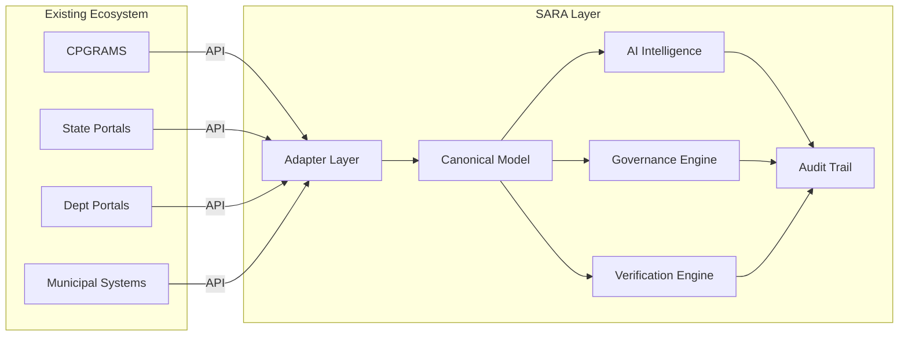

# CPGRAMS Analysis

## System Overview

The **Centralised Public Grievance Redress and Monitoring System (CPGRAMS)** is the Government of India's flagship digital platform for managing public grievances. It is operated by the Department of Administrative Reforms and Public Grievances (DARPG) under the Ministry of Personnel, Public Grievances & Pensions.

## Verified Capabilities (as of 2025–2026)

### Access & Reach

| Feature | Details |
|---|---|
| Portal access | 24/7 online access via pgportal.gov.in |
| Mobile access | CPGRAMS mobile app (integrated with UMANG) |
| Physical access | 5 lakh+ Common Service Centres (CSCs) |
| Coverage | All Central Ministries, Departments, States, UTs |
| Language support | 22 scheduled languages + English |
| Voice access | "Samadhan Didi" voice chatbot (launched May 2026) via Bhashini integration |

### Core Process

| Stage | Description |
|---|---|
| Submission | Online, mobile, voice, or CSC-assisted |
| Routing | AI-powered intelligent routing to appropriate authority |
| Assignment | Reaches designated Grievance Redressal Officer (GRO) |
| Resolution | Officer processes and resolves within timeline |
| Feedback | Feedback Call Centre contacts citizen post-resolution |
| Appeal | Citizen can appeal to Nodal Appellate Authority if dissatisfied |

### AI/ML Capabilities

| Capability | Status |
|---|---|
| Intelligent classification & routing | Deployed |
| Pattern recognition | Deployed (identifies systemic issues) |
| Root cause analysis | Deployed (policy-level insights) |
| AI-HI hybrid model | Active (AI processes, humans handle sensitive cases) |
| AI-based quality validation | Under "NextGen CPGRAMS" initiative |

### Monitoring & Accountability

| Feature | Description |
|---|---|
| GRAI | Grievance Redressal Assessment & Index — monthly ministry/state rankings |
| Review modules | Senior-level oversight of pending grievances |
| Data Strategy Unit (DSU) | Identifies recurring policy gaps and systemic issues |
| Feedback Call Centre | Post-resolution citizen satisfaction assessment |
| Timeline enforcement | 21-day standard resolution timeline |

### Performance Metrics

| Metric | Value |
|---|---|
| Average disposal time (2026) | 13–14 days (down from 157 days in 2014) |
| Annual volume (2024) | ~27 lakh grievances |
| GRO network | 1.11 lakh+ officers |
| Citizen satisfaction | 76% (Jan–Jun 2026) |
| Consecutive months >1 lakh disposals | 46+ months (as of Jun 2026) |
| Resolved (2020–2024) | 1.12 crore+ grievances |

## Architecture (What Is Known)

| Aspect | Details |
|---|---|
| API architecture | RESTful Web APIs |
| State integration | API-based with majority of States/UTs |
| Data format | Standardized fields (Grievance ID, Category, Status, Action Report) |
| Security | Government network protocols, role-based access |
| Technical management | National Informatics Centre (NIC) |

> [!NOTE]
> Detailed API specifications (JSON/XML schemas, endpoints, authentication protocols) are provided by NIC only to authorized state nodal officers during onboarding. They are not publicly documented.

## Identified Capability Gaps (Where SARA Fits)

### Gap 1: Case-Level Proactive Accountability Intelligence

**CPGRAMS has**: Department-level performance monitoring (GRAI), review modules
**CPGRAMS lacks**: Real-time, per-grievance risk scoring, inactivity detection, and predictive SLA breach analysis

**SARA provides**: Continuous per-grievance monitoring with an Accountability Risk Score (0–100) that synthesizes SLA proximity, inactivity duration, complaint severity, officer history, and other signals into an explainable risk assessment.

### Gap 2: Evidence-Aware Pre-Closure Verification

**CPGRAMS has**: Post-resolution feedback call, appeal mechanism
**CPGRAMS lacks**: Mandatory pre-closure evidence verification with citizen confirmation as a workflow state

**SARA provides**: A `VERIFICATION` state between resolution submission and closure. Officers must submit evidence. Citizens are actively asked to confirm or reject. AI assists in checking evidence quality signals (file existence, metadata, timestamps, location correlation).

### Gap 3: Structured Escalation with Accountability Dossiers

**CPGRAMS has**: Appeal facility, review modules
**CPGRAMS lacks**: Automated, policy-driven escalation with structured, machine-generated accountability dossiers for supervisors

**SARA provides**: Configurable escalation policies that generate comprehensive accountability dossiers — complete timeline, risk scores, inactivity periods, warnings sent, evidence state, citizen feedback — enabling supervisors to make informed decisions.

### Gap 4: Explainable AI Decisions

**CPGRAMS has**: AI classification and routing
**CPGRAMS lacks**: Transparent, auditable reasoning for AI decisions with confidence scores

**SARA provides**: Every AI recommendation (classification, priority, risk score, duplicate detection) comes with an explanation: input signals, confidence level, contributing factors, and alternative categories considered.

### Gap 5: Cross-System Accountability Layer

**CPGRAMS has**: API integration with state portals
**CPGRAMS lacks**: A unified intelligence and accountability layer that can operate across CPGRAMS, state portals, department portals, and municipal systems simultaneously

**SARA provides**: Adapter-based interoperability architecture with a canonical grievance model. SARA normalizes grievances from multiple sources and applies uniform accountability intelligence.

### Gap 6: Configurable Governance Policy Engine

**CPGRAMS has**: Uniform central policies (21-day timeline, GRAI metrics)
**CPGRAMS lacks**: Tenant/department-configurable SLA policies, escalation rules, and risk thresholds

**SARA provides**: A governance engine with configurable SLA policies, escalation rules, reminder schedules, and risk thresholds per department/organization. Deterministic, not AI-dependent.

### Gap 7: Semantic Duplicate/Cluster Detection

**CPGRAMS has**: Pattern recognition at systemic level
**CPGRAMS lacks**: Real-time semantic duplicate detection that clusters related citizen complaints about the same underlying issue

**SARA provides**: Vector-embedding-based semantic similarity detection that identifies when multiple complaints (potentially using different wording, different languages) refer to the same physical issue.

## SARA ↔ CPGRAMS Relationship

## Key Takeaway

SARA respects CPGRAMS's existing capabilities and positions itself as a **complementary accountability intelligence layer**. It fills gaps that CPGRAMS's architecture — designed for grievance *management* — was not specifically designed to address: **proactive risk intelligence, evidence-aware verification, policy-configurable escalation, and cross-system accountability monitoring**.
