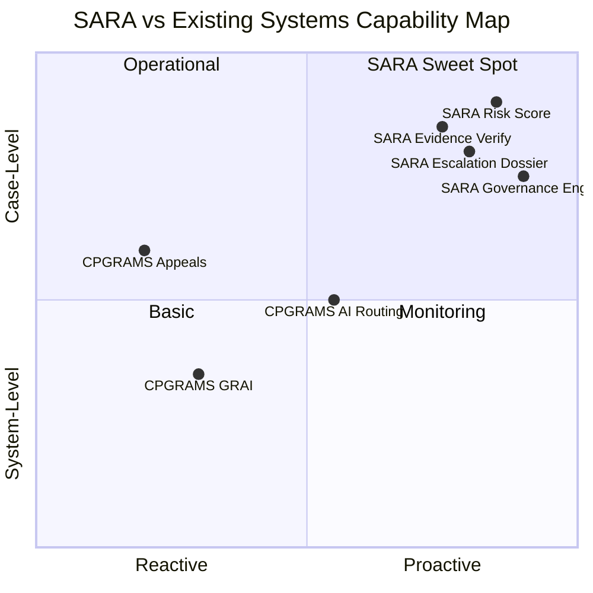

# Gap Analysis

## Methodology

This analysis compares the capabilities of existing public grievance systems (primarily CPGRAMS) against the accountability requirements that SARA addresses. Each gap is assessed for:

- **Severity**: How critical the gap is for governance outcomes
- **Evidence basis**: Whether the gap is verified, reasonably assumed, or hypothesized
- **SARA capability**: What SARA specifically provides to address it

## Gap Summary Matrix

| # | Gap Area | Existing State | SARA Capability | Severity | Evidence |
|---|---|---|---|---|---|
| G1 | Per-grievance proactive risk monitoring | Department-level metrics only (GRAI) | Real-time Accountability Risk Score per grievance | 🔴 Critical | Verified gap |
| G2 | Pre-closure evidence verification | Post-resolution feedback only | Mandatory VERIFICATION workflow state with evidence + citizen confirmation | 🔴 Critical | Verified gap |
| G3 | Predictive SLA breach detection | Reactive SLA tracking | Predictive risk model estimating breach probability before it occurs | 🟠 High | Reasonable assumption |
| G4 | Structured escalation dossiers | Review modules, appeal | Auto-generated accountability dossiers with complete timeline + risk analysis | 🟠 High | Reasonable assumption |
| G5 | Explainable AI reasoning | AI routing exists (black-box concern) | Every AI output with confidence, explanation, and audit trail | 🟠 High | Verified concern |
| G6 | Cross-system accountability | API integration exists | Unified accountability intelligence across systems via adapters | 🟡 Medium | Reasonable assumption |
| G7 | Configurable governance policies | Uniform central policies | Per-department/tenant SLA, escalation, and risk configurations | 🟡 Medium | Reasonable assumption |
| G8 | Semantic duplicate clustering | Pattern recognition at systemic level | Real-time vector-based semantic similarity for complaint clustering | 🟡 Medium | Reasonable assumption |
| G9 | Officer inactivity detection | Not specifically documented | Per-officer activity monitoring with automated reminders | 🟠 High | Verified gap |
| G10 | Circular routing detection | Not addressed | AI detection of "pass-the-buck" routing patterns | 🟠 High | Verified problem |

## Detailed Gap Analysis

---

### G1: Per-Grievance Proactive Risk Monitoring

**Current state**: CPGRAMS tracks department-level performance via GRAI. Senior officials can review pending cases in aggregate. However, there is no documented system for real-time, per-grievance risk scoring that proactively flags individual cases likely to fail.

**Impact**: Officers and supervisors discover problematic cases reactively — after SLA breaches, after citizen complaints, or during periodic reviews. Preventive intervention is difficult at scale.

**SARA capability**:
- Accountability Risk Score (0–100) computed continuously for every active grievance
- Factors: SLA proximity, inactivity duration, complaint severity, officer workload, historical patterns, resource dependencies, evidence state
- Every score is explainable: supervisors see exactly why a case scored 91/100
- Risk thresholds trigger automated workflows (warnings, reminders, escalations)

**Evidence basis**: Verified gap — no public documentation of per-grievance predictive risk scoring in CPGRAMS.

---

### G2: Pre-Closure Evidence Verification

**Current state**: CPGRAMS uses a post-resolution Feedback Call Centre and appeal mechanism. However, the standard workflow allows grievances to transition to "resolved" based on officer action reports without mandatory evidence or citizen pre-confirmation. The 24% dissatisfaction rate and documented "premature closure" concerns evidence this gap.

**Impact**: Grievances are closed based on officer claims, not verified outcomes. Citizens must reactively appeal. "Premature closure" undermines trust in the system.

**SARA capability**:
- Explicit `RESOLUTION_SUBMITTED` → `VERIFICATION` → `CLOSED/REOPENED` workflow
- Officers upload evidence (photos, documents, work orders) with resolution
- AI checks evidence signals: file existence, metadata, timestamps, location correlation
- Citizens receive active verification request: "Has this been genuinely resolved?"
- Rejection triggers `REOPENED` with possible escalation
- All evidence, citizen feedback, and verification decisions are audit-logged

**Evidence basis**: Verified gap — 24% dissatisfaction rate, documented "marked as resolved" problem, no published pre-closure verification workflow.

---

### G3: Predictive SLA Breach Detection

**Current state**: CPGRAMS enforces a 21-day timeline and tracks whether cases are within/outside this window. There is no documented predictive model that estimates breach probability before the breach occurs.

**Impact**: Interventions happen after the SLA is already breached, not before. Time-sensitive cases (safety, health) may miss windows for effective action.

**SARA capability**:
- ML model trained on historical patterns to estimate breach probability
- Features: current state, time-in-state, officer workload, category, department, historical disposal rates, complexity indicators
- Early warnings at configurable thresholds (e.g., >60% breach probability)
- Enables preventive resource allocation and reassignment

**Evidence basis**: Reasonable assumption — no public evidence of predictive SLA models in CPGRAMS.

---

### G4: Structured Escalation Dossiers

**Current state**: Escalation in CPGRAMS occurs through appeals and review modules. Supervisors reviewing escalated cases must manually piece together the timeline, actions, and context.

**Impact**: Supervisors spend time reconstructing case history instead of making decisions. Escalation context is fragmented.

**SARA capability**:
- Auto-generated structured dossier containing:
  - Complaint ID, category, priority, creation date
  - Assigned officer, department
  - Complete action timeline with timestamps
  - Inactivity periods
  - Risk score with explanation
  - All warnings and reminders sent
  - Evidence submitted
  - Citizen feedback
  - Current state and recommended next action
- Presented as a single, decision-ready view for supervisors

**Evidence basis**: Reasonable assumption — GRAI exists for department benchmarking but case-level structured dossiers are not documented.

---

### G5: Explainable AI Reasoning

**Current state**: CPGRAMS uses AI for classification and routing. However, AI governance literature identifies "black-box" concerns with these systems — it is unclear how classification decisions are made or audited.

**Impact**: When AI misclassifies a critical grievance (e.g., an electrical safety issue routed to general maintenance), there's no transparent trail explaining why.

**SARA capability**:
- Every AI classification includes: top-N categories with confidence scores, key input signals, reasoning chain
- Every risk score includes: factor-by-factor breakdown
- Every duplicate detection includes: similarity score and matched complaint references
- All AI outputs are logged immutably for audit

**Evidence basis**: Verified concern — AI governance literature and EY/GARP reports identify explainability as a critical need.

---

### G6: Cross-System Accountability
**Current state**: Integration exists but is fragmented; unified real-time monitoring across platforms is missing.
**SARA capability**: Canonical model and adapters normalize grievances across sources for unified intelligence.

### G7: Configurable Governance Policies
**Current state**: Centralized uniform policies (like 21-day SLAs).
**SARA capability**: Per-department, tenant-configurable SLA, escalation, and risk threshold policies.

### G8: Semantic Duplicate Clustering
**Current state**: Pattern recognition handles systemic trends but lacks real-time similarity matching.
**SARA capability**: Vector-based semantic duplicate detection to cluster related issues regardless of phrasing.

### G9: Officer Inactivity Detection
**Current state**: Accountability often triggers post-breach.
**SARA capability**: Tracks "time since meaningful action" and factor this into predictive risk scores.

### G10: Circular Routing Detection
**Current state**: "Pass-the-buck" routing remains a recognized challenge in manual processing.
**SARA capability**: State and routing history tracked to detect circular paths and prioritize escalation.

## Competitive Positioning

## Conclusion

SARA's value proposition is defensible because it targets a specific, validated cluster of gaps:

1. **Proactive** (not reactive) accountability
2. **Case-level** (not department-level) intelligence
3. **Evidence-aware** (not claim-based) verification
4. **Explainable** (not black-box) AI
5. **Configurable** (not uniform) governance

These gaps exist even in CPGRAMS's modernized "NextGen" form, because they represent a fundamentally different layer of capability — **accountability intelligence** — that sits above **grievance management**.
