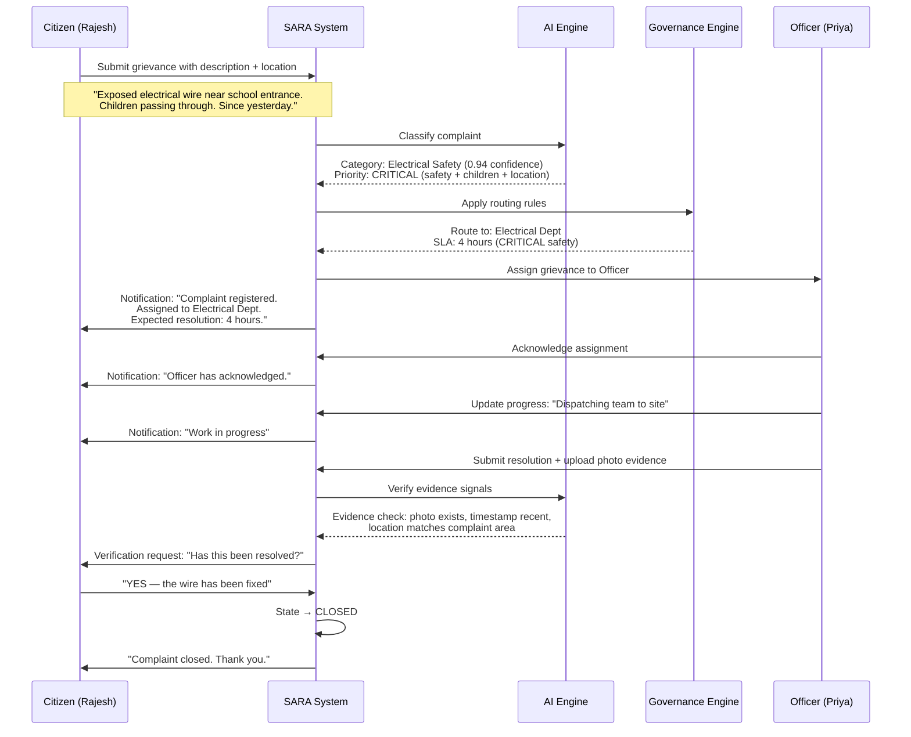
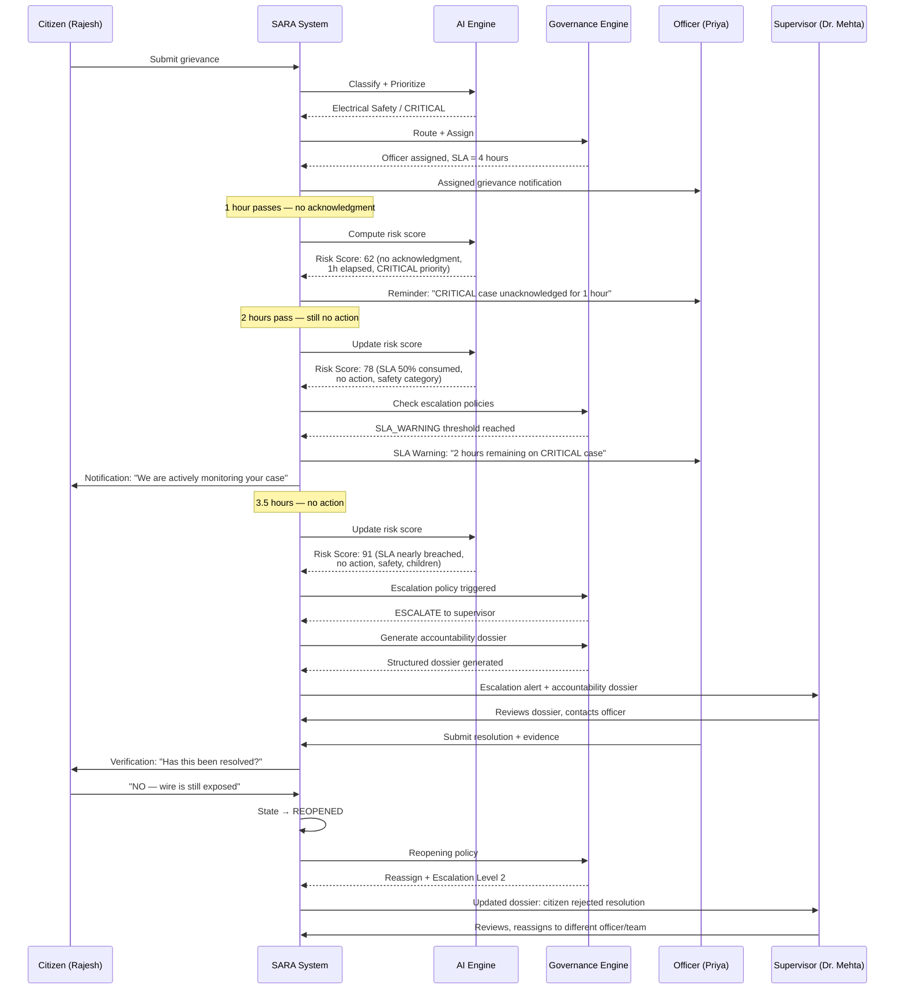

# User Journeys

## Journey 1: Citizen Submits and Tracks a Grievance (Happy Path)

### Trigger
Rajesh notices an exposed electrical wire near a school entrance that poses a safety risk to children.

### Flow

### Key SARA Features Demonstrated
- AI classification with confidence score
- Priority assessment with reasoning
- Smart routing based on category and policies
- SLA assignment based on priority
- Progress tracking and notifications
- Evidence-backed resolution
- Citizen verification before closure

---

## Journey 2: Delayed Grievance → Escalation → Accountability Dossier (Primary Demo)

### Trigger
Same complaint as Journey 1, but the officer fails to act.

### Flow

### Key SARA Features Demonstrated
- Proactive risk score calculation
- Automated reminders at configurable thresholds
- SLA warning before breach
- Policy-driven escalation (not AI-driven)
- Accountability dossier generation
- Citizen rejection → reopening workflow
- Complete audit trail of every event

---

## Journey 3: Officer Processes a Prioritized Queue

### Trigger
Priya logs into SARA in the morning to see her assignments.

### Flow

1. **Dashboard loads**: Shows 12 active grievances sorted by risk score
2. **Top case**: Risk Score 91 — Exposed wire near school (CRITICAL, SLA in 30 min)
3. **AI summary**: "Citizen reports exposed electrical wire near ABC School entrance. Safety risk to children. Filed 3.5 hours ago. No action taken. SLA expires in 30 minutes."
4. **Recommended action**: "Dispatch emergency repair team immediately. Upload photo evidence before and after repair."
5. **Priya acts**: Updates status → IN_PROGRESS, adds remark: "Team dispatched"
6. **Team completes**: Priya uploads before/after photos, marks RESOLUTION_SUBMITTED
7. **System**: Enters VERIFICATION, notifies citizen
8. **Dashboard updates**: Case moves from "Active" to "Pending Verification"

### Key SARA Features Demonstrated
- Risk-based prioritization
- AI-generated summaries
- Recommended next actions
- Evidence upload workflow
- Clear state transitions

---

## Journey 4: Supervisor Reviews Escalated Cases

### Trigger
Dr. Mehta receives an escalation alert.

### Flow

1. **Alert**: "1 new escalation: CRITICAL case #GRV-2024-0847"
2. **Opens accountability dossier**:
   - Complaint: Exposed wire near school
   - Category: Electrical Safety | Priority: CRITICAL
   - Created: 14:00 | SLA Deadline: 18:00
   - Assigned Officer: Priya Sharma
   - **Timeline**:
     - 14:00 — Submitted, classified, assigned
     - 15:00 — Reminder sent (no acknowledgment)
     - 16:00 — SLA Warning sent (no action, Risk: 78)
     - 17:30 — Escalation triggered (Risk: 91)
   - **Risk breakdown**: Safety category (+25), SLA 88% consumed (+30), zero progress updates (+20), no acknowledgment (+16)
   - **Evidence state**: No evidence uploaded
   - **Citizen feedback**: None yet
   - **Recommended action**: "Immediate reassignment or direct supervisor intervention required"
3. **Dr. Mehta acts**: Contacts officer directly, or reassigns case
4. **Dashboard**: Shows department-wide SLA trends, identifies if this is a pattern

### Key SARA Features Demonstrated
- Structured accountability dossier
- Explainable risk score breakdown
- Complete event timeline
- Supervisor decision support
- Pattern identification

---

## Journey 5: Duplicate Complaint Clustering

### Trigger
Three citizens independently report:
- "Large pothole near ABC School" (Complaint #101)
- "Road damaged near the school" (Complaint #102)
- "Dangerous hole at school entrance" (Complaint #103)

### Flow

1. **AI detects semantic similarity**: All three complaints cluster around the same physical issue
2. **System suggests**: "Potential duplicate cluster detected (3 complaints, similarity >0.85)"
3. **Officer sees**: Cluster view showing all related complaints
4. **Resolution**: Fixing the root issue resolves all three. Evidence linked to the cluster.
5. **All citizens**: Receive verification request for the same fix
6. **Impact**: One repair, three satisfied citizens, proper attribution

---

## Journey 6: Admin Configures Governance Policies

### Trigger
Vikram needs to configure SLA policies for the new Health Department onboarding.

### Flow

1. **Admin dashboard**: Navigate to Policy Configuration
2. **SLA Policy**: Create "Health Department SLA"
   - CRITICAL: 4 hours
   - HIGH: 24 hours
   - MEDIUM: 7 days
   - LOW: 14 days
3. **Escalation Policy**: Create "Health Escalation"
   - Warning at 50% SLA consumed
   - Auto-reminder at 75% SLA consumed
   - Escalate to supervisor at 100% SLA consumed (breach)
   - Escalate to director at 150% SLA consumed (if still unresolved)
4. **Department setup**: Create Health Department, assign officers, link policies
5. **Integration**: Configure adapter for state health portal (if available)

### Key SARA Features Demonstrated
- Configurable, non-hardcoded policies
- Department-specific SLA and escalation rules
- Admin governance over system behavior
